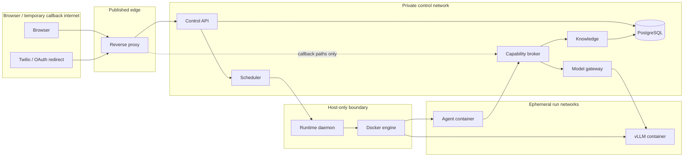
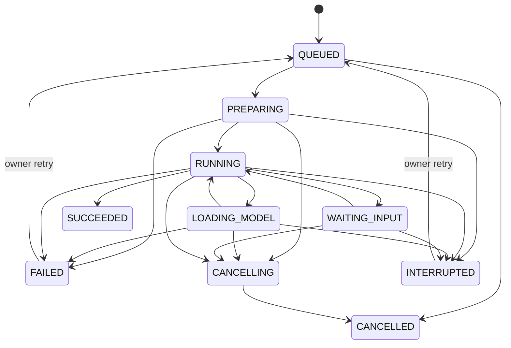
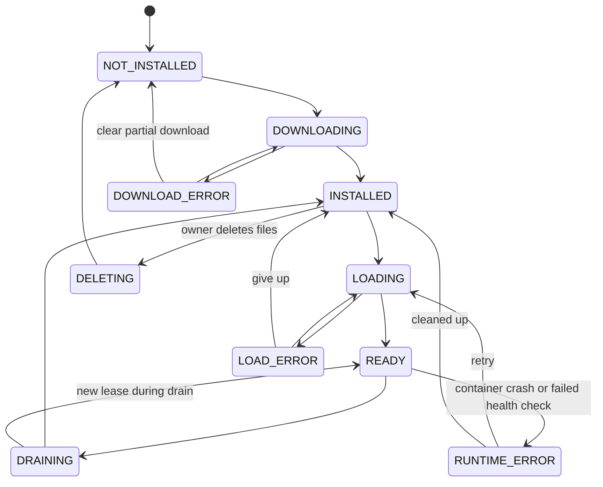
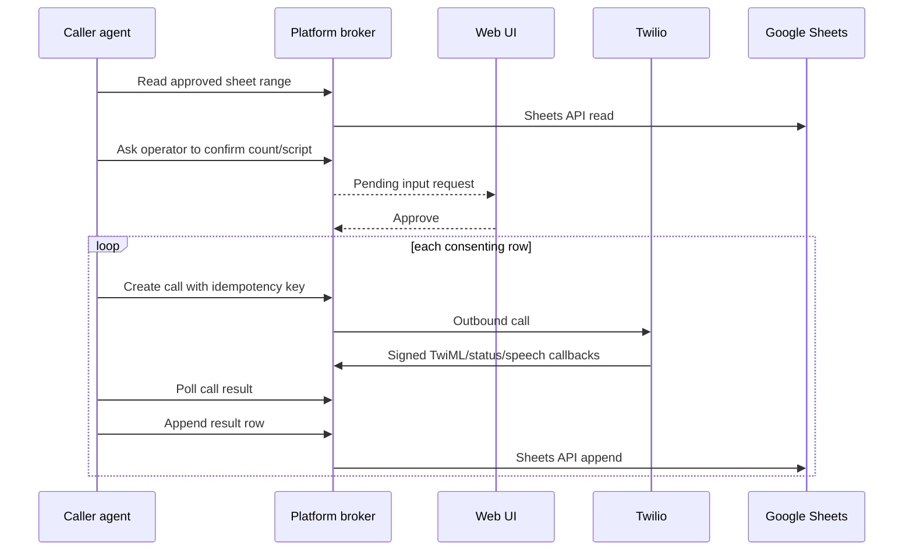
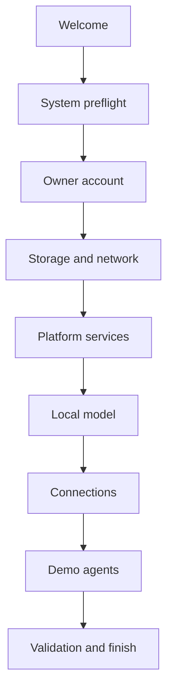
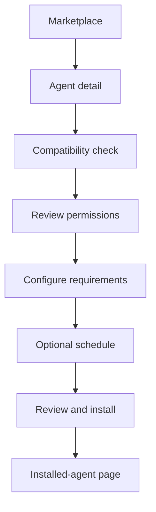
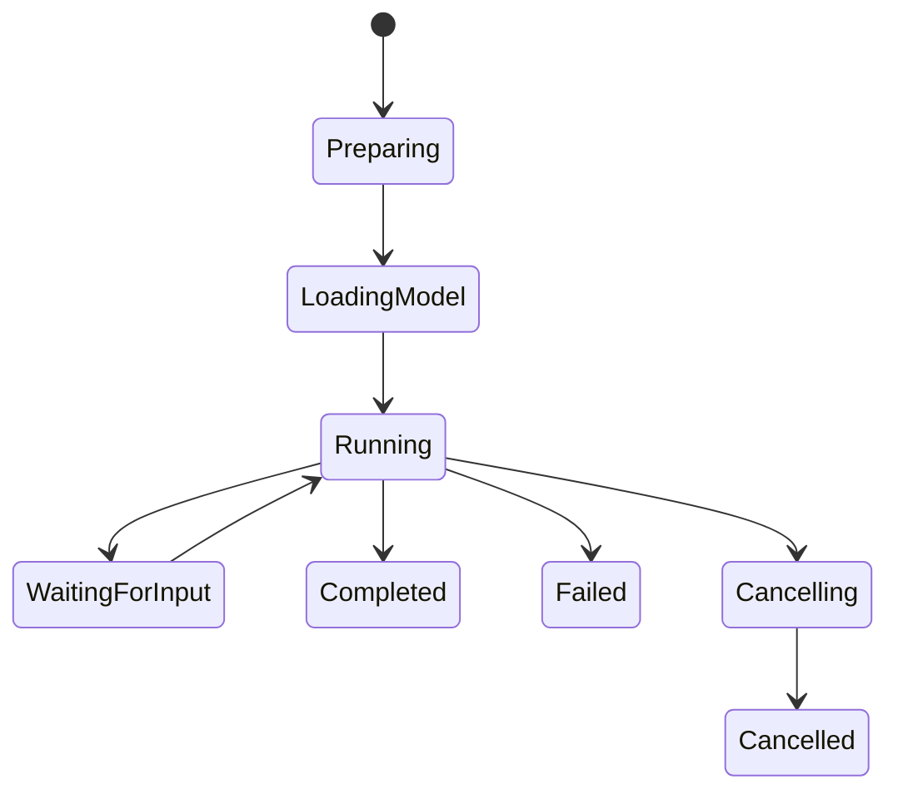
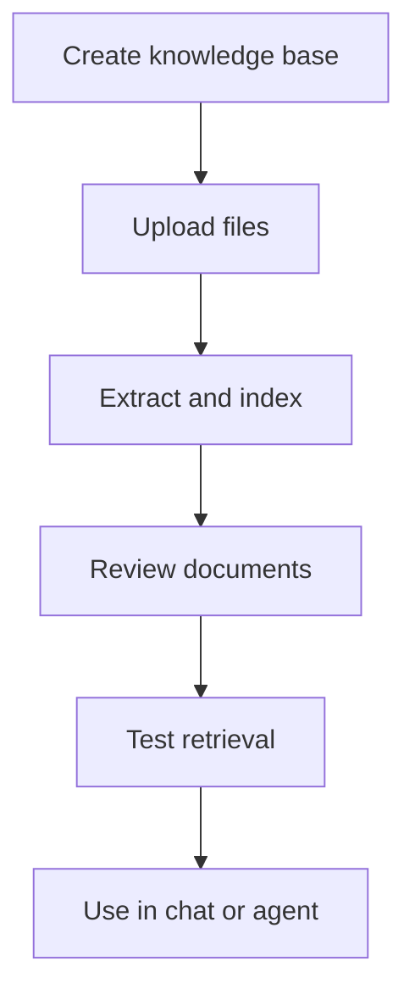

# Crewquarters — Implementation Plan

> **Your own local AI crew.**

- Version: 1.2 branded blueprint with UI/UX specification
- Research and decision date: 2026-09-24
- Target: a working demo on laptops and an NVIDIA GB10/DGX OS-class appliance
- Team: Nikhil Hiro Ghind, Akshay Sunil Navani, Nikhil Sajan Khaneja, Srija Taduri, Vineet Kumar
- Delivery: six sequential stages, each closed by a gate; the first stakeholder vertical-slice demo happens at the end of Stage 3

## 1. Executive decision record

This plan builds Crewquarters as a single-node, single-owner platform first. Crewquarters is a local agent marketplace where the owner assembles their own local AI crew. The product is a local web application plus a small host daemon. Docker Compose runs PostgreSQL and the application services. The host daemon starts isolated agent containers and on-demand vLLM containers. A browser UI controls the system. Agents use a Python SDK and capability broker rather than receiving infrastructure or provider credentials.

The following decisions are fixed for v1 so independent work does not drift:

| Area | v1 decision | Deferred alternative |
| --- | --- | --- |
| Orchestration | Docker Compose + systemd host daemon | k3s/Kubernetes |
| Tenancy | One device owner; optional additional local users only after demo | Organizations and hosted multi-tenancy |
| Database | One PostgreSQL 16+ database with `pgvector` | Redis, separate vector DB, workflow DB |
| Job queue | PostgreSQL table, leases, `SKIP LOCKED`, idempotent enqueue | Temporal, Celery/Redis, Kafka |
| Agents | One digest-pinned Docker container per run | Long-lived pods, arbitrary binaries |
| Agent network | No general egress; platform capabilities are proxied | User-defined internet access |
| Local models | vLLM in an NVIDIA-tested GB10 container | Ollama, TensorRT-LLM, llama.cpp |
| Residency | On-demand leases, stop after idle timeout | Always-on model or public sleep endpoints |
| Knowledge | Local files + PostgreSQL text/chunks/vectors | S3/MinIO and dedicated vector database |
| Embeddings | Small CPU embedding model | Permanently resident GPU embedding server |
| Local auth | First-run owner/password/session cookie | OIDC/SAML/passkeys |
| Google auth | OAuth web-server flow with offline access | Service-account domain delegation |
| Voice | Twilio, verified demo recipients only | General telephony abstraction |
| Cloud models | OpenAI and Anthropic adapters only | General model router/catalog |
| Marketplace | Curated local catalog and developer import/publish | Public marketplace backend, payments |
| Waiting input | Container waits with heartbeat; retry after platform restart | Durable language-level checkpointing |
| Multi-node | Explicitly out of v1 | Ray/vLLM across two GB10 units |

The user statement “if the model is not in use it should be loaded” is treated as a typo. The implemented rule is: **downloaded models remain on disk, but a model is resident in unified memory only while a run/chat holds a lease or during a short idle grace period.**

## 2. Success criteria and scope guardrails

### 2.1 Must work

- Laptop profile launches the complete control plane without NVIDIA hardware.
- GB10 profile uses real vLLM local inference from an `arm64`-compatible, NVIDIA-tested container.
- The catalog installs, configures, starts, observes, stops, and uninstalls the two bundled agents.
- A run can request a local model by logical profile, not a raw endpoint.
- A run can explicitly request an enabled OpenAI or Anthropic profile.
- A local model starts only on demand and unloads when no leases remain.
- An agent can schedule a 10:00 run in a named timezone.
- An agent can ask a question that appears in the web UI and continue after an answer.
- Users can upload supported documents, index them, and retrieve source-aware passages.
- Optional chat uses a selected local model and knowledge base, and can be disabled.
- Google OAuth supports scheduled Gmail access and Sheets read/write for test users.
- Caller agent completes a verified-recipient call and writes a speech response/status to Sheets.
- Gmail agent creates a previous-calendar-day digest grouped by urgency.
- A reboot preserves state but does not eagerly load an unused model.

### 2.2 Explicit demo limits

- Maximum three recipients per caller run by default.
- Maximum 200 Gmail messages per digest by default; the UI warns on truncation.
- Maximum individual knowledge file 25 MiB and knowledge base 1 GiB by default.
- Text extraction only; scanned PDFs are rejected with a useful error.
- One primary generative vLLM server is the default. Concurrent small models are an experimental setting guarded by measured admission control.
- A waiting input keeps its agent container alive for up to 24 hours (`maxInputWaitSeconds`). Time spent in `WAITING_INPUT` does not count against the run's `activeTimeoutSeconds`. Host restart interrupts the attempt.
- The marketplace accepts only bundled images or an administrator-imported image pinned by digest.
- The public internet never sees the Docker API, database, runtime daemon, vLLM, or internal broker.

### 2.3 Not accepted as “done”

- A happy-path mock that never runs on `aarch64`.
- Giving agent containers OAuth refresh tokens, cloud keys, Twilio keys, or Docker access.
- Calling a model directly from the web browser.
- Keeping a large model resident after chat is disabled and all runs finish.
- Claiming container isolation makes arbitrary marketplace code safe.
- Making the temporary webhook tunnel the default permanent deployment.

## 3. Hardware and platform implications

NVIDIA documents the DGX Spark class as a 20-core Arm CPU, 128 GB coherent unified memory, 273 GB/s memory bandwidth, ConnectX-7, up to 1,000 TOPS FP4 with sparsity, support for models up to 200B on one unit, and 405B in a dual-unit configuration. These upper model-size statements do not imply interactive speed, arbitrary precision, or automatic compatibility.

Consequences for implementation:

1. **Everything installed on the host must support `arm64`.** Python wheels, Node builds, Docker images, native parsing libraries, PostgreSQL extensions, and installer packages all need an architecture check in CI.
2. **Unified does not mean unlimited memory.** Model weights, KV cache, the OS, database, document parsing, agents, filesystem cache, and CUDA allocations compete for the same 128 GB.
3. **Bandwidth matters.** Small/quantized models are the main demo path. A dense 70B model should not be the baseline even when a quantized form fits.
4. **Model compatibility is empirical.** The catalog must pin an NVIDIA-tested vLLM container and model revision/arguments; it must not construct arbitrary launch commands from untrusted manifest fields.
5. **Container support is favorable.** NVIDIA documents Docker and the NVIDIA Container Toolkit as preinstalled/configured on DGX Spark. The installer still verifies this rather than assuming an OEM image is identical.
6. **Two-node support is a separate phase.** NVIDIA's playbook uses QSFP, passwordless SSH, and Ray for multi-node vLLM. ConnectX is hardware capability, not transparent pooled memory.

### 3.1 Initial capacity policy

Use configuration rather than hard-coded promises:

```yaml
memoryPolicy:
  systemReserveGiB: 24
  maxServingGiB: 96
  loadSafetyMarginGiB: 8
  defaultMaxModelLen: 8192
  idleUnloadSeconds: 600
  oneGenerativeModelByDefault: true
```

Before every load, sample host available memory and NVIDIA process/memory telemetry. A model profile has:

- pinned weight bytes from the local snapshot;
- quantization/dtype;
- an empirically measured startup peak;
- configured KV-cache budget;
- a context/batch envelope;
- an `arm64`/GB10 validation status.

Admission succeeds only when:

`currently_reserved + measured_or_estimated_new_peak + safety_margin <= serving_limit`

If telemetry and catalog estimates disagree, use the more conservative value. A failed load transitions to `ERROR`, captures sanitized logs, and releases the reservation.

## 4. Runtime architecture

### 4.1 Network and trust zones



Enforcement rules:

- Reverse proxy routes only documented public endpoints. Internal routes reject edge-network traffic.
- The proxy forwards exactly two callback groups to the capability broker: the Google OAuth callback (`/api/v1/connections/google/callback`) and the Twilio voice/gather/status paths (`/api/v1/callbacks/twilio/*`). Every other path goes to the control API or UI.
- Runtime daemon listens on a Unix socket with a dedicated group, not TCP.
- Only the daemon process can access Docker.
- Agent networks can reach one capability-broker address. They cannot resolve or connect to PostgreSQL, vLLM, the control API, Docker, or the host gateway.
- The broker calls Google/Twilio. The model gateway calls OpenAI/Anthropic. Agents have no generic proxy endpoint.
- Twilio webhook signatures and OAuth `state` are validated before data is accepted.

### 4.2 Deployment units

| Unit | Form | Public port | Persistent mounts | Privilege |
| --- | --- | --- | --- | --- |
| Reverse proxy/UI | Container | `8080` dev; `443` HTTPS profile | none | non-root |
| Control API | Container | none directly | none | non-root |
| Scheduler/worker | Container | none | none | non-root |
| Capability broker | Container | none directly; proxy forwards callback paths only | none | non-root; outbound allowlist; master key read-only |
| Knowledge service | Container | none | documents directory read/write | non-root |
| Model gateway | Container | none | none | non-root; outbound allowlist for OpenAI/Anthropic; master key read-only |
| PostgreSQL/pgvector | Container | none | database directory | postgres user |
| Runtime daemon | Host systemd service | Unix socket | models, run scratch, logs | dedicated service user; controlled Docker access |
| vLLM | On-demand container | private network only | model cache read-only | NVIDIA GPU device only |
| Agent run | Ephemeral container | private network only | per-run scratch only | non-root, hardened |

### 4.3 Service contracts

All external/control endpoints use `/api/v1`. Internal endpoints use `/internal/v1`. JSON uses camelCase over HTTP and snake_case inside Python/database code. IDs are UUIDv7 where supported. Timestamps are RFC 3339 UTC. Errors follow this shape:

```json
{
  "error": {
    "code": "MODEL_CAPACITY_EXCEEDED",
    "message": "Not enough safe unified memory for this model.",
    "requestId": "...",
    "details": {}
  }
}
```

Every mutating request accepts or generates an idempotency key. OpenAPI is the canonical HTTP contract; generated TypeScript and Python clients are committed and checked for drift in CI.

## 5. Control API specification

### 5.1 Public endpoints

| Area | Endpoints | Notes |
| --- | --- | --- |
| Bootstrap/auth | `POST /bootstrap`, `POST /sessions`, `DELETE /sessions/current`, `GET /me` | `/bootstrap` works once |
| Catalog | `GET /catalog/agents`, `GET /catalog/agents/{id}` | Curated local records |
| Installations | `POST /agent-installations`, `GET/PATCH/DELETE /agent-installations/{id}` | Install approves exact permissions |
| Runs | `POST /runs`, `GET /runs`, `GET /runs/{id}`, `POST /runs/{id}/cancel` | Manual/scheduled origins |
| Run stream | `GET /runs/{id}/events` | Server-sent events with reconnect cursor |
| Inputs | `GET /input-requests`, `POST /input-requests/{id}/answer` | Reject double answer/version conflict |
| Schedules | `POST/GET /schedules`, `PATCH/DELETE /schedules/{id}` | Cron + IANA timezone + misfire policy |
| Models | `GET /models`, `POST /models/{id}/install`, `POST /models/{id}/load`, `POST /models/{id}/unload` | Manual load useful for demo; policy still applies |
| Model events | `GET /models/{id}/events` | Download/load progress |
| Knowledge | `POST /knowledge-bases`, `POST /knowledge-bases/{id}/documents`, list/delete/query endpoints | Multipart upload, async ingestion |
| Chat | `POST /chat/sessions`, `POST /chat/sessions/{id}/enable`, `POST .../disable`, `POST .../messages` | Streaming response endpoint may be SSE |
| Connections | `GET /connections`, Google start/callback/disconnect, provider key create/delete/test | Secret values never returned |
| Settings | `GET/PATCH /settings` | Timezone, idle timeout, callback base URL |
| Health | `GET /health/live`, `GET /health/ready`, `GET /system/status` | Status includes architecture and GPU checks |
| Audit | `GET /audit-events` | Owner only; filters and pagination |

### 5.2 Internal runtime API

The control-plane client signs every request with a local service credential and communicates through the daemon Unix socket.

| Endpoint | Behavior |
| --- | --- |
| `POST /internal/v1/images/pull` | Pull exact digest; stream progress; reject mutable-only reference |
| `POST /internal/v1/runs` | Start a run from an approved installation and immutable runtime spec |
| `POST /internal/v1/runs/{id}/cancel` | Stop then kill after grace period |
| `GET /internal/v1/runs/{id}` | Container status, exit code, timestamps, bounded log cursor |
| `POST /internal/v1/models/{id}/start` | Start allowlisted vLLM image/arguments/model path |
| `POST /internal/v1/models/{id}/stop` | Drain gateway, stop container, verify memory release |
| `GET /internal/v1/models/{id}` | State and health; no raw Docker object returned |
| `GET /internal/v1/host/capacity` | Architecture, memory, disk, GPU/runtime checks |

The daemon never accepts a raw `docker run` payload, arbitrary mounts, privileged flags, host networking, arbitrary command override, or arbitrary vLLM flags. It builds Docker requests from validated platform records.

## 6. PostgreSQL design

One database is used. Alembic owns migrations. The `vector` extension is enabled by an initialization migration. Large binaries remain on disk because PostgreSQL backup/restore and vacuum behavior would be unnecessarily costly; the database remains the source of truth through file metadata, content hashes, and status records.

### 6.1 Core tables

| Table | Essential fields / constraints |
| --- | --- |
| `users` | id, email/username, password_hash, role, created_at; unique normalized username |
| `sessions` | hashed token, user_id, expires_at, last_seen_at |
| `settings` | typed key/value, version; never plaintext secrets |
| `encrypted_secrets` | owner_type/id, provider, ciphertext, key_version, created_at; no secret logs |
| `oauth_connections` | user_id, provider, provider_subject, scopes, encrypted_secret_id, expiry/status; unique provider subject per user |
| `agent_catalog_entries` | agent_id, metadata, current_version, source, trust_status |
| `agent_versions` | agent_id/version, complete manifest JSON, image digest, schema/sdk protocol, created_at; immutable |
| `agent_installations` | user_id, agent_version_id, config JSON, approved_permissions JSON, enabled, version |
| `agent_runs` | installation_id, trigger, state, scheduled_for, current_attempt, config snapshot, result/error, timestamps |
| `run_attempts` | run_id, attempt, runtime/container refs, lease expiry, exit code, error; unique run+attempt |
| `run_events` | run_id, monotonically increasing sequence, type, payload, created_at; unique run+sequence |
| `input_requests` | run_id, stable key, prompt/schema, state, answer, deadline, version; unique run+key |
| `schedules` | installation_id, cron, timezone, next_run_at, misfire_policy, enabled, version |
| `jobs` | type, payload, state, available_at, attempts, max_attempts, lease_owner/until, dedupe_key; partial indexes |
| `model_catalog` | logical id, HF repo/revision, license, quantization, expected/validated memory, launch profile, trust state |
| `model_installations` | model_id, disk path, size/checksum, download state/progress, last_verified_at |
| `model_instances` | model_id, state, endpoint ref, observed memory, started/ready/error timestamps |
| `model_leases` | model_id, holder_type/id, expires_at, released_at; active index |
| `knowledge_bases` | owner_id, name, embedding profile/dimension, created_at |
| `documents` | kb_id, name, mime, path, sha256, state, bytes, extracted metadata/error |
| `document_chunks` | document_id, ordinal, text, token_count, source locator, embedding vector; HNSW index after corpus threshold |
| `chat_sessions` | user_id, model_profile, kb_id, enabled, active_lease_id, timestamps |
| `chat_messages` | session_id, role, content, citations JSON, model/provider metadata, created_at |
| `provider_profiles` | owner_id, provider, display name, encrypted_secret_id, allowed models, budgets, enabled |
| `telephony_calls` | run_id, idempotency key, provider SID, destination hash/last4, state, transcript, timestamps; never log full number |
| `audit_events` | actor, action, target, request_id, security metadata, created_at; append-only application policy |

Table ownership (the owner designs the table and its access module; Nikhil Hiro Ghind reviews and merges every migration so Alembic has one linear history):

| Owner | Tables |
| --- | --- |
| Nikhil Hiro Ghind (Person 1) | `users`, `sessions`, `settings`, `agent_catalog_entries`, `agent_versions`, `agent_installations`, `agent_runs`, `run_attempts`, `run_events`, `input_requests`, `schedules`, `jobs`, `audit_events` |
| Akshay Sunil Navani (Person 2) | `model_catalog`, `model_installations`, `model_instances`, `model_leases` |
| Nikhil Sajan Khaneja (Person 3) | `encrypted_secrets`, `oauth_connections`, `provider_profiles`, `telephony_calls`, `knowledge_bases`, `documents`, `document_chunks` |
| Srija Taduri (Person 4) | none (UI only) |
| Vineet Kumar (Person 5) | none; uses APIs and test fixtures |

`chat_sessions` and `chat_messages` belong to Akshay Sunil Navani (Person 2) because chat holds model leases. Shared operational tables (`jobs`, `model_leases`, `document_chunks`) are accessed by other services only through their owner's reviewed access module.

Agent-specific configuration/results live in typed JSON snapshots for v1; shared operational facts use normalized tables. Every API list is paginated. Deletes of installations/connections are soft until no active run depends on them; document bytes and secrets are securely deleted after the database transaction commits and a cleanup job succeeds.

### 6.2 Job queue rules

Workers claim work using `SELECT ... FOR UPDATE SKIP LOCKED`, set a lease, commit, then execute. Heartbeats extend leases. Expired leases return to `available` until `max_attempts`. Retry delay uses bounded exponential backoff plus jitter. Permanent errors go to `dead` and create an operator-visible event.

`dedupe_key` is unique for live jobs. For a schedule it is `schedule:{schedule_id}:{scheduled_for_utc}`. An external side effect uses an explicit action key, such as `call:{run_id}:{sheet_row_id}`.

Queue correctness tests must kill a worker between claim and completion and prove the job is recovered without creating a second `agent_runs` record.

## 7. Scheduling and run state machines

### 7.1 Schedule evaluation

- Parse with a single pinned cron library.
- Require an IANA timezone such as `Asia/Kolkata`; reject abbreviations such as `IST`.
- Store `next_run_at` as UTC, but calculate it from the schedule timezone.
- Document DST behavior: nonexistent local times fire at the next valid instant; repeated local times fire once unless explicitly configured otherwise.
- Scheduler leader takes a PostgreSQL advisory lock. A unique scheduled-run constraint remains the final duplicate defense.
- Evaluate at least once per second and enqueue due work. Acceptance tolerance on an online, idle appliance is five seconds.
- `fire_once` is the default misfire behavior; `skip` is also exposed. Replay-all is not included.

### 7.2 Run states



The run record is durable; an attempt maps to a container. `LOADING_MODEL` means the run holds a model lease and is waiting for that model to become ready; it returns to `RUNNING` when the model is ready. `WAITING_INPUT` means the SDK has registered an outstanding question and continues heartbeating while it waits. Every non-terminal state can be cancelled; cancellation goes through `CANCELLING` so the container is stopped before the run is marked `CANCELLED`. If the container exits unexpectedly or the platform restarts, the run becomes `INTERRUPTED`. `SUCCEEDED` and `CANCELLED` are final. From `INTERRUPTED` or a retryable `FAILED`, the owner may retry: the run returns to `QUEUED` and the next start creates a new `run_attempts` row with an incremented attempt number. Input answers remain stored and keyed, so a retry can receive the existing answer when the agent asks the same stable key. Developers must guard side effects with `ctx.idempotency.once`.

### 7.3 User-input contract

`ctx.input.ask` request:

```json
{
  "key": "confirm-calls-v1",
  "title": "Confirm outbound calls",
  "prompt": "Call 3 verified recipients with the displayed script?",
  "schema": {
    "type": "object",
    "required": ["decision"],
    "properties": {
      "decision": {"type": "string", "enum": ["continue", "cancel"]}
    }
  },
  "secret": false,
  "timeoutSeconds": 86400
}
```

Runs have two independent time limits declared in the manifest `resources` block:

- `activeTimeoutSeconds` — maximum time spent working (`PREPARING`, `LOADING_MODEL`, `RUNNING`). The clock pauses while the run is `WAITING_INPUT`.
- `maxInputWaitSeconds` — maximum total time spent waiting for answers (default 86,400; platform cap 86,400). A single `ctx.input.ask` `timeoutSeconds` may not exceed the remaining wait budget.

The runtime daemon enforces both; exceeding either fails the run with `ACTIVE_TIMEOUT` or `INPUT_TIMEOUT`.

The broker verifies `userInput` permission and the run token, creates or returns the idempotent request, emits a run event, and allows the SDK to long-poll with heartbeat. UI answers validate against the saved JSON Schema. Secret answers are not included in v1; users configure secrets through Connections instead.

## 8. Model subsystem specification

### 8.1 Model catalog

The initial catalog contains two or three tested profiles rather than a free-form Hugging Face text box:

- `local.general.small`: fast, non-gated, instruct/tool-capable model used for tests and most agent tasks;
- `local.general.quality`: larger quantized model validated on the target GB10;
- `local.embedding.small`: CPU embedding model with fixed vector dimension.

Profile resolution rule: a profile name has a **family** (`local.general`, `local.embedding`) and an optional **variant** (`.small`, `.quality`). A manifest may request either a family or an exact variant.

- Requesting a family (for example `local.general`) permits any installed variant in that family. The installation binds to the family default (`local.general.small`) unless the owner selects another variant on the install or configuration screen.
- Requesting an exact variant (for example `local.general.quality`) permits only that variant.
- Agent configuration such as `modelProfile` must resolve to a variant permitted by the approved manifest profiles; the control API rejects anything else.
- The capability token carries the resolved variant, so the gateway checks one exact name at request time.

Do not finalize the exact model/version from memory. On the target device, select a current entry from NVIDIA's DGX Spark vLLM recipe catalog, pin the NGC image digest, Hugging Face revision, tokenizer revision, dtype/quantization, chat template, and launch flags, then record benchmark results. Prefer a non-gated model for the default demo to avoid an additional Hugging Face license/login failure path.

### 8.2 Install and load states



State rules:

- A new lease that arrives while a model is `DRAINING` for idle unload cancels the drain and returns it to `READY`. A manual **Unload** blocks new leases, so it never returns to `READY`.
- If a `READY` model's container crashes or fails health checks, it moves to `RUNTIME_ERROR`. Active leases receive `MODEL_UNAVAILABLE`, their runs go to `FAILED` or back to `LOADING_MODEL` according to retry policy, and the reservation is released.
- An owner can delete an installed model only when it is not resident and has no active leases. `DELETING` removes files and returns the model to `NOT_INSTALLED`; the catalog entry remains.

Downloads use a staging directory, validate available disk first, pin revisions, compute/record checksums, and atomically rename only on success. A partial download is resumable or explicitly cleared. License acceptance is recorded before download when required.

### 8.3 Lease and routing protocol

1. Agent/model gateway request specifies a logical profile and requirements (`tools`, minimum context, local/cloud policy).
2. Gateway authorizes the profile against the installation permission snapshot.
3. Gateway creates/renews a lease in PostgreSQL.
4. If not ready, one load job is deduplicated; callers wait on a bounded readiness stream.
5. Runtime daemon starts vLLM on a private network with the catalog launch profile.
6. Gateway verifies health and `served-model-name`, then marks `READY`.
7. Request is streamed through the gateway; client disconnect cancels generation when supported.
8. Completion releases or shortens the lease. A reaper unloads after all leases expire plus the idle grace.

Manual UI “Unload” first blocks new leases, waits for active requests for a short drain timeout, then refuses or force-stops only after explicit confirmation. The automated reaper never kills an active lease.

### 8.4 Normalized LLM request

The SDK exposes a conservative common subset:

```python
await ctx.llm.chat(
    profile="local.general",
    messages=[...],
    temperature=0.2,
    max_output_tokens=1000,
    response_schema=Digest.model_json_schema(),
    tools=[],
    idempotency_key="digest-final-v1",
)
```

The local adapter uses vLLM's OpenAI-compatible chat API. OpenAI uses its Responses API. Anthropic uses its Messages API. Provider-specific responses normalize to text, structured output, usage, finish reason, provider/model, latency, and request ID. Unsupported common features fail clearly rather than silently degrading.

Cloud routing is never an automatic privacy fallback. A manifest must declare the provider, the owner must approve it, a provider profile must be enabled, and the call must name a cloud profile. Apply per-run token limits, daily optional budgets, timeouts, and retry only on safe transient failures. Do not store full prompts in routine logs.

## 9. Knowledge subsystem

### 9.1 Supported pipeline

1. Accept `.txt`, `.md`, text-based `.pdf`, `.docx`, and `.csv`.
2. Validate size, MIME by content and extension, filename, and archive/path safety.
3. Write to a staging path, calculate SHA-256, then atomically move to the documents directory.
4. Extract page/section/row locators using pure-Python or verified `arm64` dependencies.
5. Normalize Unicode and whitespace while preserving headings and source locations.
6. Chunk around 800 tokens with about 120-token overlap; never cross a document boundary.
7. Embed with the pinned local CPU profile in batches.
8. Insert chunks and vectors transactionally; mark the document `READY` only when complete.
9. Query only within the authorized knowledge-base ID using cosine similarity; return text, score, document, page/section, and stable citation ID.

The embedding model and dimension are immutable per knowledge base. Changing either creates a re-index job. Duplicate hashes within one knowledge base are rejected or treated as a new named reference without duplicating vectors.

### 9.2 Retrieval contract

```json
{
  "knowledgeBaseId": "...",
  "query": "What are the cancellation terms?",
  "topK": 8,
  "filters": {"documentIds": []},
  "maxContextTokens": 5000
}
```

Response passages contain no raw filesystem path. The service returns a citation token that the UI can resolve to an authorized document/page preview. The gateway instructs the model to answer only from supplied context when RAG-only mode is selected and to state when evidence is insufficient.

### 9.3 Prompt-injection handling

Uploaded files and emails are untrusted content. Retrieval text is delimited and labeled as evidence, never concatenated into the system instruction. Agents are told not to follow embedded instructions. Connector/tool capabilities remain enforced outside the model, so a malicious document cannot grant itself permissions. Add regression fixtures with “ignore previous instructions” content and verify that no connector is invoked.

## 10. Authentication, connections, and secrets

### 10.1 Local owner auth

- First launch creates a one-time bootstrap token printed to the root-owned installer log/terminal.
- `POST /bootstrap` consumes it and creates the owner with an Argon2id hash.
- Login rotates a random opaque session token; only its hash is stored.
- Cookie is `HttpOnly`, `SameSite=Lax`, `Secure` under HTTPS, scoped to the platform origin.
- State-changing routes require CSRF validation and origin checks.
- Login and bootstrap are rate limited and audited.
- Bind to `127.0.0.1` by default. LAN mode requires an explicit choice and always serves HTTPS.
- Headless installation (no local display detected, or `--headless`) enables LAN mode at install time: it generates a device-local certificate authority and HTTPS certificate, binds the proxy to the LAN interface on `443`, and prints the URL, certificate fingerprint, and one-time setup code. The browser shows a certificate warning until the operator trusts the device CA; the fingerprint lets them verify it. Session cookies are always `Secure` in LAN mode.

### 10.2 Secret storage

Generate a 256-bit device master key at install time with mode `0600`, owned by root/service group, outside the Compose volume and backups unless the operator intentionally exports it. Encrypt each secret with an authenticated cipher and a random nonce; include provider/owner identifiers as associated data. Store key version and ciphertext in PostgreSQL. The master key is mounted read-only into exactly two services: the capability broker (Google and Twilio secrets) and the model gateway (OpenAI and Anthropic keys). Each decrypts only its own provider secrets through the shared `secret_store` library, so decrypted credentials never travel between services. Redact headers, query strings, phone numbers, OAuth codes, tokens, and prompts from logs.

Backups without the master key cannot restore connections; backups with it are sensitive. The UI offers “disconnect/delete” and a later “export recovery bundle” can be added outside demo scope.

### 10.3 Google OAuth

Use the documented web-server authorization-code flow with a library, offline access, exact redirect URI, state validation, and incremental authorization. Use separate consent actions for Gmail and Sheets so the UI explains why each permission is needed.

Demo scope choices:

- Gmail digest: `https://www.googleapis.com/auth/gmail.readonly`.
- Caller: `https://www.googleapis.com/auth/spreadsheets` because it must read an operator-supplied spreadsheet and write a results tab. `drive.file` is narrower but is not guaranteed to cover an arbitrary pasted spreadsheet unless a compatible file-selection/creation flow is added.

For a browser running on the same development computer, `http://localhost:8080/api/v1/connections/google/callback` is valid for testing when registered exactly. For a headless GB10 accessed from a laptop and for Twilio callbacks, use a fixed HTTPS demo hostname/tunnel registered in Google Cloud. Do not use the removed out-of-band flow.

Google testing-mode consequences must appear in setup docs and UI: a maximum test-user list applies, an unverified warning may appear, and authorizations/refresh tokens for these scopes expire after seven days. Reconnect is an expected demo task. Production publication with Gmail restricted scopes creates a verification and potentially security-assessment workstream.

### 10.4 Capability tokens

When a run starts, the control API mints a short-lived signed token containing:

- run ID, installation ID, agent version ID;
- exact approved capability strings;
- optional knowledge-base/model/profile IDs;
- issued/expiry times and audience;
- a nonce/token ID for revocation.

The broker checks the token on every call and checks current run state. Permissions are intersection-based: manifest request ∩ owner approval ∩ current connection/profile availability. An agent update with changed permissions requires reapproval.

## 11. Python SDK and agent packaging

### 11.1 Package surface

Package: `crewquarters-sdk`, initial protocol `v1alpha1`.

| Module | Required calls |
| --- | --- |
| `Agent` | run decorator, config validation, structured result, health handshake |
| `RunContext.events` | log, progress, metric, artifact metadata |
| `RunContext.input` | ask with stable key/JSON Schema, cancellation awareness |
| `RunContext.llm` | chat, stream, structured response, local/cloud named profile |
| `RunContext.knowledge` | search with KB scope and citations |
| `RunContext.google.gmail` | list message IDs, get sanitized message, get thread link metadata |
| `RunContext.google.sheets` | read range, append values, update values |
| `RunContext.telephony` | create fixed-script call, get status/result |
| `RunContext.idempotency` | claim/complete/retrieve a stable action key |

All calls set timeouts, propagate the run request ID, retry only idempotent operations, and raise typed exceptions (`PermissionDenied`, `NeedsConnection`, `ModelUnavailable`, `Cancelled`, `RateLimited`, `InvalidInput`). The SDK never silently selects cloud.

### 11.2 Developer workflow

Target commands (implemented by the plan, not assumed to exist now):

```bash
crewctl init my-agent
crewctl validate
crewctl test
crewctl build --platform linux/amd64,linux/arm64
crewctl publish --target local --platform-url http://localhost:8080
```

`crewctl validate` checks manifest schema, immutable image reference after build, architecture list, SDK protocol, resource limits, configuration schema, capability strings, and disallowed host/network features. `publish --target local` imports the manifest/image digest into the owner-operated catalog; it does not create a public commercial listing.

### 11.3 Image contract

- Non-root numeric user.
- Dependencies vendored into the image; no `pip install` at run time.
- Read-only root compatible.
- Receives configuration through a mounted read-only JSON file or environment pointer, never secret values.
- Uses `PLATFORM_BROKER_URL`, `PLATFORM_RUN_TOKEN`, `PLATFORM_RUN_ID`.
- Starts an SDK handshake, emits heartbeats, handles `SIGTERM`, and exits 0 only after posting a valid result.
- Builds on both target architectures in CI or declares a narrower supported list that the installer enforces.

## 12. Demo agent specifications

### 12.1 Caller agent

#### Configuration

```json
{
  "spreadsheetId": "required",
  "inputRange": "Contacts!A2:D",
  "resultRange": "Results!A:H",
  "script": "Hello {name}. This is an automated demo call...",
  "maxCalls": 3,
  "responseSeconds": 20,
  "timezone": "Asia/Kolkata"
}
```

Expected input columns: `name`, `phone_e164`, `consent`, `status`. Accept consent only from a strict allowlist such as `yes`, `true`, or `consented`; empty/ambiguous values are skipped. Validate E.164 and never send the full number to logs or LLMs.

#### Flow



The broker, not the agent, constructs TwiML. The first sentence discloses that it is an automated demo and, if recording/transcribing, provides the configured disclosure before collection. `<Gather input="speech">` captures a bounded answer. Validate Twilio's request signature using the original public URL, handle duplicate callbacks idempotently, and store only the transcript needed for the demo.

Twilio credentials are configured in Connections. A temporary fixed HTTPS endpoint is required for callbacks when services run locally. The demo uses verified team recipients only; trial availability, geography, content, and duration limits are checked during setup. No feature should suggest that legal compliance is automatic.

#### Acceptance cases

- Consent=`no` never creates a call.
- Operator cancel creates zero calls.
- Duplicate start or callback creates one provider call/result row.
- Busy, no-answer, failed, rejected, answered/no speech, and answered/speech states are visible.
- A Sheets API failure retries the write without redialing.
- Full numbers and Twilio auth credentials never appear in logs, events, or LLM prompts.

### 12.2 Daily Gmail digest agent

#### Configuration

```json
{
  "timezone": "Asia/Kolkata",
  "maxMessages": 200,
  "includeLabels": [],
  "excludeCategories": ["CATEGORY_PROMOTIONS"],
  "modelProfile": "local.general.small"
}
```

#### Flow

1. Compute `[yesterday 00:00, today 00:00)` in the configured IANA timezone and convert to epoch seconds.
2. Query Gmail with the supported `q` parameter and paginate message IDs up to the limit.
3. Fetch headers, snippet, and decoded text body. Prefer `text/plain`; sanitize HTML to text; bound per-message characters and total input.
4. Remove obvious quoted reply history where safe, but preserve sender, subject, timestamp, and message/thread ID.
5. Treat email bodies as untrusted evidence. No email text can change policies or invoke tools.
6. Summarize in deterministic batches with structured output.
7. Reduce batch summaries into `urgent`, `important`, and `lowPriority`, each containing reason, next action, sender/subject, and message reference. Add a “truncated” notice when the cap is reached.
8. Save structured result to the run; the UI renders groups and links.

Suggested urgency rubric belongs to the prompt and tests: explicit deadlines/meetings within 24 hours, security/account incidents, blocking requests from known humans, and service/payment failures can be urgent; newsletters and promotions are normally low. The model must label uncertainty rather than invent deadlines.

#### Acceptance cases

- DST/date-boundary fixtures select exactly the previous local calendar day.
- Pagination works beyond 100 messages and stops at the configured cap.
- Multipart, HTML-only, empty-body, attachment-only, and malformed messages do not crash the run.
- Prompt injection in an email does not alter grouping schema or invoke any capability.
- Every digest item maps to a fetched message/thread ID.
- Zero messages returns a successful empty digest, not a failure.

## 13. Web UI specification

The UI is an appliance control plane, not a developer console. A non-technical owner must be able to set up the device, install a model and agent, approve an action, and diagnose an ordinary failure without using a shell. Advanced information remains available, but it is progressively disclosed.

### 13.1 UX goals and operator mental model

The interface teaches four distinctions consistently:

1. **Installed versus active.** Models and agents may be installed on disk without using memory or running.
2. **Local versus cloud.** Every model action and generated result clearly identifies whether data stayed on the device or was sent to an approved cloud provider.
3. **Configured versus connected.** An agent can be installed but still require a Google/Twilio connection or model before it can run.
4. **Scheduled versus running.** Schedules create runs; they are not long-running agent processes.

Primary operator: the owner of one HP/GB10 appliance. Secondary operator: a developer validating a locally published agent. There is no tenant switcher, marketplace seller console, billing UI, or enterprise administration in v1.

Key UX rules:

- Lead with the next safe action, not infrastructure terminology.
- Show status in words and icons; never rely on color alone.
- Keep common tasks one level deep from the sidebar.
- Explain cold starts and downloads with time/progress rather than an indefinite spinner.
- Preserve form state across refresh and OAuth redirects.
- Put irreversible, external, or cloud actions behind explicit review.
- Keep logs and raw JSON under an **Advanced** disclosure.
- Never expose provider secrets after submission.

Brand language should add character without obscuring operation. Use **Your Crew** for installed agents, **Crew Requests** for pending human input, and **Command Center** as optional dashboard supporting copy. Keep precise terms such as run, model, schedule, permission, failure, and audit in controls and technical states. Do not turn every label into a nautical or mission metaphor.

### 13.2 Information architecture and routes

The desktop application uses a persistent left sidebar, a compact device-status top bar, and a content canvas. Related views use tabs instead of additional sidebar levels.

| Navigation item | Routes | Primary purpose |
| --- | --- | --- |
| Overview | `/` | Health, attention items, quick actions, active work, recent results |
| Crew | `/agents/marketplace`, `/agents/installed`, `/agents/{installationId}` | Discover agents and manage the agents already in your crew |
| Activity | `/activity/runs`, `/activity/approvals`, `/runs/{runId}` | Observe runs and answer pending Crew Requests |
| Models | `/models`, `/models/{modelId}` | Install model files and understand/load/unload residency |
| Knowledge | `/knowledge`, `/knowledge/{kbId}` | Upload, index, inspect, and test local knowledge |
| Chat | `/chat`, `/chat/{sessionId}` | Opt-in local RAG chat and conversation history |
| Connections | `/connections`, `/connections/{provider}` | Connect Google and configure Twilio/OpenAI/Anthropic |
| Schedules | `/schedules` | View next runs and manage timezones/misfire behavior |
| System | `/system/status`, `/system/audit`, `/system/settings`, `/system/backups` | Device status, security history, settings, diagnostics, backup |
| First-run setup | `/setup/*` | Resumable installation and onboarding wizard; hidden after completion |

The **Activity** item displays a badge only for items that need attention: unanswered input, failed runs not acknowledged, expired connections blocking a schedule, or model downloads requiring action. It is not a generic notification counter.

### 13.3 Application shell

#### Sidebar

- Width: 248 px expanded and 72 px icon-only at medium desktop widths.
- Product mark and device name at the top.
- Primary navigation in the middle.
- System status and owner menu at the bottom.
- The selected destination uses an icon, text weight, and left indicator—not background color alone.
- Collapse state is stored per browser.

#### Top bar

The top bar contains only high-value appliance state:

- device reachability (`Healthy`, `Degraded`, `Offline`);
- unified-memory utilization with text value and accessible meter;
- active local model, or `No model active`;
- cloud routing indicator when a cloud-backed request is running;
- pending-action button;
- owner menu.

Clicking device memory opens a non-modal resource popover that separates system reserve, loaded-model allocation, active agents, and currently available memory. It must not imply that all 128 GB is available for model weights.

#### Page structure

Every primary page follows:

1. breadcrumb when deeper than one level;
2. title and one-sentence purpose;
3. one primary action on the right;
4. status/filters where needed;
5. content using cards or tables;
6. contextual help and Advanced details at the bottom.

Use a maximum readable content width of 1440 px. Dense operational tables may span the canvas; configuration forms stay between 640 and 760 px wide.

### 13.4 First-run installation and setup wizard

The `arm64` `.deb` starts the core bootstrap service and installs a desktop launcher. Opening **Crewquarters** launches the local setup URL. The package installation itself remains non-interactive; model downloads, credentials, and validation occur in this resumable UI.



Wizard behavior:

- A vertical stepper shows completed, current, optional, and blocked steps.
- State is saved server-side after each step; reload or OAuth redirect resumes correctly.
- Back navigation never discards completed downloads or credentials.
- Optional steps show **Skip for now**, with the exact later location to finish them.
- Blocking errors include **Retry check**, supporting detail, and a copyable diagnostic code.
- The final page runs health checks and does not show success until core services and the selected model profile are usable.

| Step | UI content and actions | Completion rule |
| --- | --- | --- |
| Welcome | Product summary, version, local-first promise, link to licenses | Operator continues |
| System preflight | `arm64`, DGX OS/Ubuntu, Docker/Compose, NVIDIA runtime, GPU, memory, disk | All required checks pass; warnings explicitly accepted |
| Owner account | Username/email, password, password confirmation, recovery warning | Valid owner created and bootstrap token consumed |
| Storage and network | Data path summary, disk estimate, local-only/LAN choice, callback-mode explanation | Writable paths and chosen exposure validated |
| Platform services | Load/pull pinned images, database migration, service health progress | All core health checks ready |
| Local model | Recommended model card, size/license/performance notes, optional skip, download progress | Selected model installed and smoke-tested, or explicit skip |
| Connections | Google connect; optional Twilio/OpenAI/Anthropic; test status | Required connection for selected agents, or explicit skip |
| Demo agents | Caller and Gmail Digest cards, requirements, install toggles | Selected agents installed and configuration validity shown |
| Validation | End-to-end checks, warnings, dashboard preview, diagnostics download | Required checks pass; setup-complete flag written |

System preflight uses a check-list rather than a spinner. Each row has `Checking`, `Passed`, `Warning`, or `Failed`, a short explanation, and an expandable technical result. The UI never offers a fake “continue anyway” for an incompatible CPU architecture or missing NVIDIA container runtime when the DGX profile is selected.

### 13.5 Overview dashboard

The dashboard answers three questions in order: **Does anything need me? What is running? What can I do next?**

Layout:

1. **Needs attention** — displayed only when non-empty. Cards for agent questions, failed schedules, expired Google access, low disk, or model error. Each has one direct CTA.
2. **Quick actions** — Run a crew member, Add to your crew, Add knowledge, Start chat.
3. **Device resources** — unified memory, storage, active model, model idle-unload countdown, active agent containers.
4. **Active work** — currently running/loading/waiting runs with live progress.
5. **Recent results** — last five completed runs with agent, status, duration, local/cloud badge, and open-result action.
6. **Upcoming schedules** — next three occurrences in the owner's timezone.

When the platform is new, replace empty charts/tables with a guided three-card checklist: install a model, add an agent, run it. Do not show zero-filled analytics.

### 13.6 Agent discovery, installation, and configuration flow



#### Marketplace

- Search by name/description and filter by trigger, connector, local/cloud capability, and installed state.
- Curated cards show name, concise outcome, publisher/trust badge, version, trigger types, required connections, preferred model profile, and architecture compatibility.
- An incompatible card remains viewable but disables install and explains the missing architecture/runtime.
- `Uses cloud` is a visible label, never hidden in a detail page.
- No ratings, pricing, or popularity sorting in v1.

#### Agent detail

Sections appear in this order:

1. outcome and example result;
2. requirements and compatibility;
3. permissions grouped as `Local data`, `External services`, `Model use`, and `User interaction`;
4. configuration fields and defaults;
5. version/publisher/image digest under Advanced;
6. install/update action.

#### Install wizard

- **Compatibility:** verifies image architecture, SDK protocol, model capability, connection availability, and disk/memory envelope.
- **Permissions:** explains each capability in plain language. Cloud and phone permissions receive stronger visual treatment and cannot be approved by an unchecked global box.
- **Configuration:** generated from JSON Schema, grouped into meaningful sections with descriptions and examples.
- **Requirements:** select an existing Google connection, local model profile, knowledge base, and Twilio/cloud profile where applicable.
- **Schedule:** optional presets plus timezone; advanced cron is collapsed.
- **Review:** shows immutable version/digest, permissions, destinations, estimated model behavior, and **Install agent**.

Installation is atomic from the operator's perspective. If image pull succeeds but configuration creation fails, the UI reports `Installation incomplete`, preserves the form, and offers retry; it does not display the agent as ready.

#### Installed-agent page

Header shows agent name, enabled/disabled, readiness, version, and **Run now**. Readiness is a checklist of model, connections, permissions, and configuration. Tabs:

- **Overview:** description, readiness, next schedule, recent run, and configuration summary.
- **Runs:** filterable run table.
- **Schedule:** enabled state, plain-language recurrence, next occurrences, misfire policy.
- **Configuration:** editable generated form with unsaved-change guard.
- **Permissions:** current grants and connection binding; changed version requests reapproval.
- **Advanced:** image digest, resource limits, SDK protocol, uninstall.

### 13.7 Run, progress, and human-input flow

Run creation immediately navigates to the run detail page. A persistent status header contains agent name, state, elapsed time, trigger, local/cloud badge, and cancel action.



The UI maps backend states to operator language without losing precision:

| Backend condition | Operator label | UI treatment |
| --- | --- | --- |
| `QUEUED` | Waiting to start | Neutral badge; queue explanation if delayed |
| `PREPARING` | Preparing agent | Indeterminate progress with current step |
| `LOADING_MODEL` | Loading local model | Model name, downloaded/ready distinction, elapsed time, expandable detail |
| `RUNNING` | Running | Live step/progress and cancel action |
| `WAITING_INPUT` | Needs your input | Amber attention card, Activity badge, optional browser notification |
| `SUCCEEDED` | Completed | Result summary and output actions |
| `FAILED` | Failed | Human-readable reason, retry eligibility, diagnostic code, Advanced logs |
| `CANCELLED` | Cancelled | Neutral terminal state; whether external actions already occurred |
| `INTERRUPTED` | Interrupted | Explains restart/container loss, whether external actions already occurred, and offers **Retry run** |

Run detail anatomy:

1. status header;
2. prominent pending-input card when applicable;
3. progress stepper/timeline generated from structured events;
4. result renderer selected by the agent's declared result schema;
5. resources panel: model/provider, tokens when available, duration, connection calls;
6. **Logs** and **Raw result** under Advanced.

Human input is never presented only as a transient modal. It appears on run detail, the Activity/Approvals list, and the dashboard attention area. The answer form shows agent name, why input is needed, requested action, relevant preview, deadline, and the exact consequence of submitting.

For the caller agent, the confirmation card shows recipient count, masked numbers, the fixed script, consent validation result, maximum-call cap, and **Approve calls** / **Cancel run**. The approval button includes the count: `Approve 3 calls`.

On submit:

- disable the form and show `Submitting…`;
- use the saved input-request version to reject stale/double answers;
- display a durable `Answer submitted` state;
- keep the answered question in the event timeline;
- announce the status change through an `aria-live` region.

### 13.8 Models UI and cold-start behavior

The Models page has **Available** and **Installed** tabs. Each model card/table row separates:

- download state (`Not installed`, `Downloading`, `Installed on disk`);
- memory state (`Not loaded`, `Loading`, `Ready`, `Draining`, `Error`);
- disk size and measured/estimated memory envelope;
- context limit and capability badges;
- validation status for this hardware;
- license/gating status.

Never use a single ambiguous `Active` label.

Primary actions follow state:

- Not installed → **Install model**
- Downloading → **View progress** and **Cancel download**
- Installed/not resident → **Load now** or allow an agent to load automatically
- Ready → **Open chat** and, when no active leases, **Unload**
- Error → **View error** and **Retry**

Download detail displays bytes, percentage, current file, transfer rate, estimated time when reliable, free disk, and resumability. Model load detail shows stages such as `Starting container`, `Loading weights`, `Allocating cache`, and `Health check`. When no percentage exists, show elapsed time and latest stage—not a fake percentage.

Before a manual load, show the expected allocation and remaining system reserve. If admission fails, keep the installed model intact and offer to unload an idle model. Active leases are shown by friendly holder names (`Chat`, `Gmail Digest run #104`), not internal UUIDs alone.

### 13.9 Knowledge and chat flows

#### Knowledge-base flow



The knowledge-base detail page contains:

- summary header with document/chunk count and embedding profile;
- drag-and-drop upload zone plus file picker;
- document table with file type, size, state, chunks, added date, and action menu;
- asynchronous ingestion queue with per-file progress/error;
- **Test retrieval** panel that shows the query, top passages, score, and source locator;
- settings for name and deletion, with embedding profile immutable after creation except through explicit re-index.

Unsupported/scanned documents fail per file while valid files continue. Error copy identifies whether the issue is type, size, password protection, missing embedded text, extraction, or embedding. Deleting a document states that its chunks will stop appearing in chat.

#### Chat enablement and use

The default Chat page is an intentional inactive state, not an empty conversation. It explains that enabling chat will load/lease a model and may use substantial unified memory. The user chooses:

- local model profile;
- optional knowledge base;
- retrieval mode (`Use knowledge when relevant` or `Answer only from knowledge`);
- session title, optional.

The primary action is **Enable local chat**. If the chosen model is cold, the conversation shell opens with a stage banner and disables message submission until ready. The user may leave the page; model progress continues and appears globally.

Active chat layout:

- conversation list at desktop widths;
- central message stream;
- composer with model/knowledge chips;
- source drawer on the right when a citation is selected;
- header with `Local on this device` or explicit cloud provider badge;
- **Disable chat** action.

Assistant messages stream with a subtle cursor and a Stop action. Citations appear as numbered chips after the supported sentence and open a source drawer with document, page/section, matched passage, and **Open document**. Source text is escaped and never interpreted as HTML.

Disabling chat:

1. prevents new messages;
2. allows or cancels an active response according to the user's confirmation;
3. releases the chat lease;
4. shows `Model will unload in 10 minutes unless another run is using it`;
5. retains conversation history.

### 13.10 Connections and cloud-provider UX

Connections are provider cards with `Not connected`, `Connected`, `Needs attention`, or `Disabled` states and a last successful check time.

- **Google:** Connect opens the OAuth flow. The returning page shows granted Gmail/Sheets capabilities separately. Expired test-mode access appears as `Reconnect Google` with affected agents/schedules.
- **Twilio:** form accepts account identifier, secret, caller number, and callback status. Saved secrets are replaced, never revealed. **Test connection** performs a non-call validation; a live test call is a separate confirmed action.
- **OpenAI/Anthropic:** form accepts API key, allowed model list, optional daily token/cost guard, and enabled state. A test sends the smallest useful request and clearly states that test content leaves the device.

Cloud design rule: local resources use a neutral/teal `Local` chip; cloud resources use a purple `Cloud · Provider` chip plus an outbound-arrow icon and text. Before the first cloud call from an agent installation, the review screen states what data category may be sent. The UI never suggests that a cloud profile is an automatic fallback.

Disconnect shows affected agent installations and schedules. The action is allowed, but the confirmation explains that future runs will fail readiness until reconnected.

### 13.11 Schedules UI

The default schedule editor uses presets:

- Daily at a selected time
- Weekdays at a selected time
- Weekly on selected day/time
- Custom cron under Advanced

Always show:

- selected IANA timezone and current local time;
- a plain-language summary;
- the next three actual occurrences with timezone abbreviation/UTC offset;
- downtime behavior (`Run once when device returns` or `Skip missed run`);
- whether required connections/models are currently ready.

The schedule table shows agent, recurrence, next run, last result, enabled state, and an action menu. Toggling off asks no confirmation and gives an Undo toast. Delete requires confirmation. Editing a timezone recalculates and previews occurrences before save.

### 13.12 Gmail digest and caller result designs

#### Gmail digest result

Render the digest as three ordered sections:

1. **Urgent** — red semantic icon and count, but full text label remains.
2. **Important** — amber semantic icon and count.
3. **Low priority** — neutral collapsed section by default when long.

Each message item shows sender, subject, received time in the configured timezone, one-sentence reason, suggested next action, and **Open in Gmail**. Uncertain classification displays `Needs review`. If the message cap was reached, a persistent warning identifies the number processed and that the digest may be incomplete.

#### Caller result

Render a run summary followed by a row table:

| Field | Presentation |
| --- | --- |
| Recipient | Name plus masked phone number |
| Consent | Validated/Skipped with reason |
| Call state | Queued, ringing, answered, no answer, busy, failed |
| Response | Transcript or `No speech captured` |
| Sheet write | Written, pending retry, or failed |
| Time | Owner timezone with exact time in detail tooltip |

The summary separates `Called`, `Answered`, `Responses captured`, `Skipped`, and `Failed`; it never treats no-answer as agent failure. Retrying a Sheets write is distinct from retrying/redialing a call.

### 13.13 System, audit, backup, and recovery UI

`System Status` groups checks by Device, Runtime, Storage, Database, Network callbacks, and Model serving. Each check has a current state, last checked time, and remediation. **Download diagnostics** produces a redacted bundle.

`Audit` is a filterable table for authentication, permissions, agent changes, secret/connection changes, model residency, cloud calls, and callback-validation failures. It shows metadata, never secret content or full prompts.

`Backups` shows last backup, included content, location, size, and **Create backup**. Including secret recovery material is off by default and requires password confirmation plus a warning. Restore is an Advanced operation with file validation and a pre-restore backup.

Global degraded/offline behavior:

- API unreachable: persistent red banner, cached page read-only, retry indicator.
- SSE disconnected: amber `Live updates paused—reconnecting` banner; bounded polling fallback.
- Device low disk: global warning and block new model/document installs at the server-defined threshold.
- Runtime daemon unavailable: existing history remains viewable; run/model actions are disabled with reason.
- OAuth expired: affected connection and agent pages link to the same reconnect flow.

### 13.14 Visual design system

The visual direction is calm, technical, and appliance-like: high information clarity, generous spacing, restrained color, and no consumer-marketplace ornament. Use a light theme for v1; implement all colors as semantic CSS variables so a dark theme can be added without rewriting components.

#### Core tokens

| Token | Value | Use |
| --- | --- | --- |
| `--color-bg` | `#F6F8FB` | Application background |
| `--color-surface` | `#FFFFFF` | Cards, panels, dialogs |
| `--color-surface-subtle` | `#EEF2F7` | Secondary panels and table headers |
| `--color-text` | `#172033` | Primary text |
| `--color-text-muted` | `#5B677A` | Secondary text; validate contrast by size |
| `--color-border` | `#D7DEE8` | Dividers and controls |
| `--color-primary` | `#4F46E5` | Primary actions and focus-related accents |
| `--color-primary-hover` | `#4338CA` | Primary hover |
| `--color-local` | `#087E8B` | Local-processing badge/accent |
| `--color-cloud` | `#7C3AED` | Explicit cloud badge/accent |
| `--color-success` | `#147D64` | Success states |
| `--color-warning` | `#9A5B00` | Warning/attention states |
| `--color-danger` | `#B42318` | Failure/destructive actions |
| `--color-info` | `#175CD3` | Informational state |

Semantic colors receive pale background companions computed/validated for WCAG contrast. Color never carries meaning without text/icon/state shape.

Typography:

- UI font: `Inter`, falling back to `ui-sans-serif`, system fonts.
- Monospace: `ui-monospace` for IDs, digests, logs, and cron.
- Base body: 14 px/20 px; long-form help and chat: 16 px/24 px.
- Page title: 28 px/36 px, weight 650–700.
- Section title: 20 px/28 px, weight 600.
- Labels: 13–14 px, weight 550–600.
- Do not use all-caps for headings or statuses.

Layout tokens:

- 4 px base spacing scale: 4, 8, 12, 16, 24, 32, 48, 64.
- Form-control minimum height: 40 px; primary actions: 42–44 px.
- Card radius: 12 px; inputs/buttons: 8 px; status pills: full radius.
- Border is preferred to heavy shadow. Elevated dialog/popover shadow is restrained.
- Motion duration: 120–200 ms for UI transitions; progress is functional, not decorative.
- Minimum pointer target: 44 × 44 px where practical.

Iconography uses one outline family such as Lucide at consistent 18/20/24 px sizes. Never mix filled illustrative icons with outline operational icons. Product illustrations are unnecessary for v1; empty states may use a simple icon plus concise copy.

### 13.15 Component inventory and interaction rules

| Component | Required behavior |
| --- | --- |
| Status badge | Text + icon + semantic tone; stable vocabulary across screens |
| Resource meter | Numeric value, units, accessible label, safe/warning thresholds from API |
| Data table | Sort/filter where useful, row focus, responsive card fallback, empty/error states |
| Stepper | Completed/current/optional/blocked; keyboard and screen-reader semantics |
| Timeline | Ordered structured events, reconnect-safe sequence IDs, current step emphasized |
| Progress | Determinate only with real percentage; otherwise stage + elapsed time |
| JSON Schema form | Labels/descriptions/defaults/errors, secret field treatment, grouped sections |
| Permission row | Capability, plain-language impact, resource/provider, approval control |
| Confirmation dialog | Action, consequence, affected resources, explicit primary verb |
| Toast | Success/undo for non-critical feedback; never sole location for an error |
| Error panel | What happened, user action, retry, diagnostic code, Advanced detail |
| Empty state | Why empty, one next action, no decorative dashboard zeros |
| Skeleton | Matches final layout; used only during initial data load |
| Log viewer | Escaped text, time/level filters, pause/autoscroll, copy sanitized segment |
| Source drawer | Citation metadata and escaped passage without losing conversation context |

Button hierarchy:

- One primary button per page or dialog.
- Secondary buttons for safe alternate actions.
- Tertiary/text buttons for navigation or low-emphasis actions.
- Destructive actions use danger styling only in confirmation and final action, not throughout the page.
- Disabled controls always have a nearby reason or tooltip accessible by keyboard.

### 13.16 Loading, empty, error, and optimistic states

Each screen must implement all five states: initial loading, empty, ready, partial/degraded, and error.

- Use optimistic updates only for reversible metadata actions such as enable/disable schedule; roll back with an inline error and Undo where possible.
- Do not optimistically claim that a model loaded, an agent started, a connection succeeded, or a call was placed.
- Long operations create durable backend jobs and return a resource ID before the UI shows progress.
- Browser refresh reconnects to the existing job/run rather than starting a duplicate.
- A timed-out HTTP request is `Outcome unknown` until resource state is re-read; never repeat an external side effect automatically from the browser.
- Errors use stable codes for support, but start with plain-language remediation.

### 13.17 Forms, validation, and content design

- Validate format locally on blur/submit and treat server validation as authoritative.
- Show errors next to the field and summarize them at the top on submit.
- Preserve entered values when a server call fails, except secret fields after they have been accepted.
- Secret inputs support replace/delete, never reveal/copy-after-save.
- Cron, model flags, image digests, and raw IDs live under Advanced.
- Times display in the user's chosen timezone with the zone visible; exact UTC is available in a tooltip/detail.
- File sizes use binary units where capacity decisions matter.
- Avoid vague labels such as `Submit`, `OK`, `Active`, and `Processing`; use `Install agent`, `Approve 3 calls`, `Enable local chat`, `Loading model weights`.
- Confirmation text states external impact and cloud/data movement explicitly.

### 13.18 Accessibility and responsive behavior

Target WCAG 2.2 AA for the complete operator path.

- Full keyboard access with logical focus order and visible 2 px focus ring.
- Skip-to-content link and landmarks for sidebar, header, main, and drawers.
- Labels/programmatic descriptions for every field and meter.
- `aria-live="polite"` for ordinary progress/status and assertive announcements only for blocking failures.
- Reduced-motion media query removes nonessential transitions and streaming cursor animation.
- Status, charts, and resource meters have text equivalents.
- Dialogs trap focus, restore it to the invoking control, and close with Escape unless an operation is in an unsafe commit phase.
- Tables provide headers and a card/list alternative below 768 px.
- Logs are keyboard-scrollable and do not steal focus during live updates.

Responsive breakpoints:

| Width | Behavior |
| --- | --- |
| `≥1280 px` | Expanded sidebar, multi-column dashboard, optional right source drawer |
| `768–1279 px` | Collapsible icon sidebar, two-column cards, drawers overlay content |
| `<768 px` | Top bar + navigation drawer, single column, tables become cards, sticky primary action |

Mobile supports monitoring, approvals, schedule toggles, and chat. Large model installation, complex agent configuration, log analysis, and system restore may show `Best on a larger screen` but must remain functionally accessible.

### 13.19 Frontend implementation boundaries

- React + TypeScript + Vite.
- Route-level code splitting; no server secrets or provider SDKs in the bundle.
- Generated OpenAPI client is the only HTTP data-access layer.
- TanStack Query owns server state; local component state does not duplicate backend truth.
- SSE client stores the latest sequence ID, reconnects with `Last-Event-ID`, deduplicates events, and falls back to bounded polling.
- A small internal component library implements the tokens and inventory above. Avoid adopting a large visual framework whose defaults conflict with the appliance design.
- JSON Schema form renderer supports platform extensions for grouping, secret fields, connection/model/KB selectors, help text, and conditional fields.
- All agent/provider strings are rendered as text. Sanitized Markdown is allowed only in declared description/help fields through a strict allowlist; raw HTML is never rendered.
- Browser persistence stores only non-sensitive preferences and unsaved non-secret drafts. Session cookies and server-side drafts handle sensitive flows.
- Playwright page objects cover setup, agent install/run/input, model cold start, knowledge/chat/citation, Gmail digest, caller approval/results, OAuth reconnect, and degraded states.

### 13.20 UI acceptance criteria

- [ ] A first-time operator completes setup without a shell after installing the `.deb`.
- [ ] Setup is resumable after refresh and Google OAuth redirect.
- [ ] The UI never conflates installed-on-disk with loaded-in-memory.
- [ ] Local and cloud inference are distinguishable on selection, run, result, and audit screens.
- [ ] Installing an agent displays and records each requested capability.
- [ ] A permission-changing update cannot run until reapproved.
- [ ] A model cold start shows stages and remains attached after navigation/refresh.
- [ ] A pending agent question is recoverable from dashboard, Activity, and run detail.
- [ ] Caller approval shows masked recipients, script, consent result, and call count.
- [ ] Gmail digest results remain traceable to message IDs/links and expose truncation.
- [ ] Knowledge upload failures are per-file; successful files continue indexing.
- [ ] Chat cannot send until enabled/model-ready and releases its lease when disabled.
- [ ] SSE reconnect does not duplicate timeline events or start operations again.
- [ ] API/runtime outage leaves cached history readable and risky actions disabled.
- [ ] No provider secret, OAuth token, raw Docker error, or unescaped agent HTML appears.
- [ ] Automated accessibility checks plus a keyboard-only manual pass cover every primary flow.
- [ ] Layout is usable at 1440, 1024, 768, and 390 CSS pixels.
- [ ] A new operator completes the final demonstration script from the written UI copy alone.

## 14. Deployment and installation

### 14.1 Compose profiles

`compose.yaml` contains:

- default core: proxy/UI, API, scheduler, broker, knowledge, gateway, PostgreSQL;
- `dev`: bind mounts/hot reload, mock runtime daemon, mock provider adapters;
- `dgx`: real daemon socket, GPU vLLM network/profile, target directories;
- `callbacks`: fixed HTTPS tunnel sidecar/config only for controlled demos.

Health dependencies use health checks, not start order alone. Every application image is built for `linux/amd64` and `linux/arm64`. PostgreSQL/pgvector image selection is verified for both. vLLM uses the current NVIDIA-recommended image for GB10 and is not forced into the generic multi-arch build.

### 14.2 Host installer

The `arm64` `.deb` and its development install script perform the same idempotent steps:

1. Require a supported Ubuntu/DGX OS base and `aarch64` for appliance mode.
2. Verify disk, 128 GB class memory warning, `docker`, Compose, NVIDIA Container Toolkit, and a minimal `docker run --gpus=all ... nvidia-smi` test.
3. Create `crewquarters` system user/group and directories:
   - `/etc/crewquarters/`
   - `/var/lib/crewquarters/postgres/`
   - `/var/lib/crewquarters/models/`
   - `/var/lib/crewquarters/documents/`
   - `/var/lib/crewquarters/runs/`
   - `/var/log/crewquarters/`
4. Generate the master key and bootstrap token with safe permissions.
5. Install/enable the runtime-daemon systemd unit and Unix socket.
6. Install pinned Compose configuration and environment file without checked-in secrets.
7. Pull core images and start them.
8. Run migrations exactly once under an advisory lock.
9. Print the local URL and one-time bootstrap instructions.

Release artifacts:

| Artifact | Contents | Intended use |
| --- | --- | --- |
| `crewquarters_<version>_arm64.deb` | Runtime daemon/CLI, systemd service and socket, Compose definitions, desktop launcher, default config, migrations launcher, upgrade/uninstall scripts | Normal connected installation |
| `crewquarters-offline_<version>_arm64.tar.zst` | The `.deb`, pinned core/agent/vLLM OCI image archives, checksums, signatures, SBOMs, and optional validated model bundle | Reliable event/demo installation |

The `.deb` package hook must remain short and non-interactive. It may create users/directories, install units, and start the bootstrap stack; it must not ask for passwords/API keys, run OAuth, download a large model, or open a root-owned GUI. It installs `/usr/share/applications/crewquarters.desktop`, whose unprivileged launcher opens the local `/setup` UI described in section 13.4. Privileged setup actions pass through the restricted runtime daemon rather than executing browser-provided shell commands.

The setup UI displays platform-image/model download or offline-import progress as durable jobs. Closing the browser does not cancel them. Reopening the launcher returns to the current step. A headless installation enables HTTPS LAN mode (section 10.1) and prints the LAN URL, certificate fingerprint, and one-time setup code so the same wizard can run from another computer.

Uninstall stops services and removes binaries/config, but preserves `/var/lib/crewquarters` unless the operator supplies an explicit purge flag. Upgrade backs up the database, applies reversible checks, pulls pinned images, migrates, and health-checks. The demo must document a rollback to the previous Compose/image version; database downgrade migrations are not assumed.

### 14.3 Callback exposure

OAuth and Twilio are the only reasons to expose an inbound callback path. For a demo, provision one fixed HTTPS hostname through an approved tunnel and route only:

- Google callback path (`/api/v1/connections/google/callback`);
- Twilio voice/TwiML, gather, and status callback paths (`/api/v1/callbacks/twilio/*`).

The proxy forwards these paths to the capability broker, which owns OAuth token exchange and Twilio callback handling. No other path reaches the broker from the edge.

All normal UI use remains local or authenticated. The proxy applies body limits and rate limits. Twilio signatures are mandatory. OAuth callbacks still require state/session correlation. Stop the tunnel after the demonstration.

### 14.4 Kubernetes decision gate

Do not begin k3s work during v1 unless Compose is proven impossible on the exact appliance. After the demo, write a short ADR if at least two of these requirements appear: multi-device scheduling, service high availability, many long-running agents, team-standard Kubernetes operations, or a Kubernetes-native sandbox. K3s officially supports `arm64`, but GPU runtime classes, persistent volumes, upgrades, and networking need dedicated appliance validation.

## 15. Observability, operations, and backup

### 15.1 Required telemetry

- JSON logs with request ID, run ID, service, level, event type; no secrets/full prompts/full phone numbers.
- Metrics endpoint per service: request latency/errors, job depth/age, active runs, model startup/first-token/tokens-per-second, memory/disk, retrieval latency, OAuth refresh errors, provider usage.
- Run events stored in PostgreSQL for the UI; system logs rotate on disk.
- Device status samples `/proc`, disk usage, Docker health, and NVIDIA telemetry where available.
- Audit events for login, connection changes, permission approvals, agent install/update/uninstall, model load/unload, cloud calls, and callback validation failures.

Do not add Prometheus/Grafana to the default demo stack. Expose metrics and provide a diagnostics bundle command. Add the observability stack later if needed.

### 15.2 Backup

Provide a command that creates:

- compressed `pg_dump`;
- document manifest and document bytes;
- catalog/config version metadata;
- optional encrypted-secret recovery material only with an explicit flag and warning.

Do not back up model weights by default; they are large and reproducible from pinned revisions. Restore verifies checksums and reports missing downloadable models. Test backup/restore on both architectures before the final gate.

## 16. Security and privacy work

### 16.1 Threats and v1 mitigations

| Threat | Required mitigation | Residual risk |
| --- | --- | --- |
| Malicious agent image | Curated/digest-pinned only, non-root, read-only, caps dropped, no general egress, brokered capabilities | Kernel/container escape; public arbitrary code is not supported |
| Docker socket takeover | Only narrow host daemon has access; no raw Docker API | Daemon compromise remains high impact |
| Secret theft | Brokered calls, envelope encryption, root-owned master key, redaction | Host root can access secrets |
| OAuth CSRF/code theft | Exact redirect, state, secure session, short callback window | Misconfigured public hostname |
| Webhook spoofing/replay | Twilio signature validation, timestamp/deduplication, HTTPS | Provider/account compromise |
| Prompt injection | Untrusted-content delimiters, capabilities enforced outside model, regression tests | Model may still summarize badly |
| Resource exhaustion | Per-run limits, upload limits, job quotas, model admission control, disk watermarks | One large model can degrade appliance responsiveness |
| Supply-chain compromise | Pin image/model revisions and checksums; generate SBOM in CI | Upstream artifact trust |
| Duplicate side effects | Idempotency records, unique keys, provider IDs, retry classification | External provider ambiguity after timeout |
| Cloud privacy leak | Explicit provider profile/permission/call, audit event, no automatic fallback | User-approved data still leaves device |
| Phone abuse | Verified consent field, operator approval, small cap, verified recipients, disclosure | Legal rules vary; counsel required beyond demo |

### 16.2 Security release checks

- Dependency and container vulnerability scan with documented severity policy.
- SBOM for every core and bundled-agent image.
- Secret scanner on repository and built artifacts.
- No mutable image tags in release manifests.
- Negative authorization tests for every broker capability.
- Attempt container access to host, database, model endpoint, metadata/host gateway, and internet; tests must fail.
- Fuzz/limit tests for manifests, uploads, webhook bodies, run events, and JSON Schema inputs.
- Browser security headers and CSRF/origin tests.

## 17. Five-person work division

Each person owns a vertical area and its tests, documentation, generated contracts, and operational runbook. Shared contract changes require review from affected owners. No person waits for another service: mocks are generated from frozen OpenAPI/events during Stage 1.

| Person | Primary ownership | Secondary duty |
| --- | --- | --- |
| 1 — Nikhil Hiro Ghind · Platform/API lead | Control API, PostgreSQL schema/migrations, job queue, scheduler, auth, contracts | Integration lead and release branch |
| 2 — Akshay Sunil Navani · Runtime/model lead | Host daemon, Docker isolation, model catalog/install/load/leases, vLLM gateway, appliance package | GB10 performance/capacity validation |
| 3 — Nikhil Sajan Khaneja · Data/connectors lead | Knowledge pipeline, pgvector retrieval, secret store, Google OAuth/Gmail/Sheets, Twilio and cloud adapters | Security/privacy review |
| 4 — Srija Taduri · Web product lead | React UI, generated client, SSE UX, configuration forms, chat/citations, accessibility | Demo UX and operator documentation |
| 5 — Vineet Kumar · SDK/agents/QA lead | Python SDK, CLI/manifest tooling, both agents, contract fixtures, E2E harness | Compose, demo scripts, acceptance report |

Load balancing rule: Vineet Kumar (Person 5) owns Compose during laptop development; Akshay Sunil Navani (Person 2) owns the host `.deb` and DGX profile. Nikhil Hiro Ghind (Person 1) owns canonical OpenAPI/data migrations. Nikhil Sajan Khaneja (Person 3) owns capability strings and provider adapters. Srija Taduri (Person 4) owns no backend business logic.

## 18. Six-stage delivery sequence

Delivery is organized as six sequential stages rather than calendar weeks. A stage is complete only when its gate passes; the next stage may start preparatory work in parallel, but it does not close until the prior gate is green.

### Stage 1 — Contract freeze and walking skeleton

Shared deliverables:

- ADRs for Compose, trust model, one database, model leases, OAuth/callback strategy.
- Monorepo tooling, lint/test/type-check, multi-arch CI skeleton.
- `agent-manifest.schema.json`, capability vocabulary, OpenAPI v1 skeleton, event schemas.
- UI route map, semantic design tokens, shared component skeleton, responsive application shell, and screen-state fixtures.
- Initial Alembic migration and generated clients.
- Compose starts UI placeholder, API health, PostgreSQL/pgvector, scheduler placeholder, brokers, and mock runtime.
- A fake agent run moves `QUEUED → RUNNING → SUCCEEDED` and streams events to the UI.

Gate S1: `make dev-up && make test-contract` passes on `amd64`; CI builds an `arm64` smoke image.

### Stage 2 — Core platform and SDK

- Owner bootstrap/login/session/CSRF.
- Catalog/install/config/run/schedule APIs.
- PostgreSQL job leases/recovery and run state machine.
- Runtime daemon starts a hardened hello-world agent by immutable image digest.
- SDK handshake, events, progress, cancellation, and input request path.
- UI catalog, installation, run detail, schedules, pending-input panel.
- Secret store and provider connection skeleton.

Gate S2: a scheduled sample agent asks for input, receives it in the UI, finishes, and survives a worker crash without duplicate run creation.

### Stage 3 — Local model vertical slice

- Model catalog/download states and progress.
- vLLM local adapter, gateway streaming, model lease/load/unload/reaper.
- Mock local model for laptop and real smoke model on available NVIDIA/GB10 hardware.
- `ctx.llm.chat`, structured output, usage/event normalization.
- Chat enable/disable and streaming UI without knowledge.
- Cloud adapter skeleton with explicit permission/profile checks.

Gate S3: a bundled sample agent and chat share one local model; after both release leases, the model unloads and memory release is observed. This is the first stakeholder demo.

### Stage 4 — Knowledge and Google

- Upload/extraction/chunking/embedding/index/query.
- RAG chat with citations and injection fixtures.
- Google OAuth, encrypted refresh tokens, reconnect state.
- Narrow Gmail/Sheets broker APIs and SDK clients.
- Connection, knowledge, and cited chat UI.
- Gmail digest agent end-to-end with fixtures and a live test account.

Gate S4: upload three documents and receive cited chat; schedule a live previous-day Gmail digest with no token exposed to the agent.

### Stage 5 — Caller and appliance deployment

- Twilio connection and signed callbacks through fixed tunnel.
- Caller agent, approval/input, idempotency, Sheets results.
- Full `arm64` application image build.
- Idempotent host installer, systemd daemon/socket, Compose DGX profile.
- On-device model benchmark/tuning and conservative model catalog values.
- Reboot/upgrade/backup/restore paths.

Gate S5: fresh GB10 installation completes both agents and local RAG chat; verified phones receive no duplicate calls during injected retries.

### Stage 6 — Hardening and release rehearsal

- Security negatives, vulnerability/SBOM/secret scans, log redaction audit.
- Failure injection: provider timeout, OAuth expiry, out-of-memory, full disk, worker/agent/model crash, duplicate webhook, reboot.
- Accessibility pass, UX error copy, setup/runbooks, diagnostics bundle.
- Performance report on target hardware.
- Two complete fresh-install demo rehearsals by someone who did not build the feature.
- Known-limitations and go/no-go report.

Gate S6: every release checklist item has evidence; no Sev-1/Sev-2 defect; demo can be reset and repeated from written instructions.

## 19. Ready-to-use implementation prompts

These prompts are intended to be handed to the five developers or coding agents after the Stage 1 contract files are created. Replace bracketed repository paths only if the agreed layout changes. Each prompt requires small, reviewed commits and prohibits unilateral contract drift.

### Person 1 prompt (Nikhil Hiro Ghind) — Platform/API lead

```text
You own the Crewquarters control plane in services/control_api and
services/scheduler, plus migrations and packages/contracts. Read README.md and
PLAN.md first. Treat packages/contracts/openapi.yaml, agent-manifest.schema.json,
and events/*.json as canonical. Do not give the API direct Docker access.

Implement, in this order:
1. PostgreSQL models and Alembic migrations for the tables you own (section 6.1
   ownership table), and review/merge every other owner's migration so Alembic
   keeps one linear history.
2. One-time bootstrap, Argon2id login, opaque hashed sessions, cookie/CSRF and
   origin enforcement, and audit logging.
3. Catalog, install/configure, run/cancel/retry, pending-input, schedule, model
   status, connection metadata, and system-status APIs exactly to OpenAPI.
4. A PostgreSQL SKIP LOCKED queue with leases, heartbeat, bounded retries,
   dedupe keys, dead state, advisory-lock scheduler leadership, IANA timezone
   cron calculation, fire-once/skip misfires, and unique scheduled runs.
5. SSE event replay using Last-Event-ID and generated client drift checks.

Provide unit tests for every state transition and permission check; integration
tests that kill a worker after claim; DST/misfire fixtures; migration upgrade
tests from an empty database; and an API fixture for other owners. Expose no
secret ciphertext. Do not implement UI, Docker calls, model inference, Google,
or parsing. If a contract is insufficient, open a focused contract change for
review by the affected owner before implementation.

Done means make test-platform passes, generated clients show no diff, API docs
match behavior, and a fake runtime adapter drives a scheduled run through SSE.
```

### Person 2 prompt (Akshay Sunil Navani) — Runtime/model lead

```text
You own services/runtime_daemon, services/model_gateway, infra/systemd,
infra/debian, and the DGX Compose profile. Read README.md and PLAN.md. The daemon
is the only component that can access Docker. It listens on a Unix socket and
must never accept arbitrary docker-run payloads, mounts, commands, privileges,
networks, or vLLM flags.

Implement, in this order:
1. Host capability probe and typed internal client/server contract.
2. Hardened per-run containers: non-root, read-only root, tmpfs, caps dropped,
   no-new-privileges, PID/CPU/memory limits, active-time limit that pauses
   during WAITING_INPUT plus a separate input-wait limit, no Docker/host mounts, and a
   broker-only network. Pull by immutable digest and report bounded logs/status.
3. Pinned model download/install verification and the model state machine.
4. PostgreSQL-backed model leases, capacity reservations, load dedupe, readiness,
   drain/idle unload, crash reconciliation, and verified memory release.
5. vLLM OpenAI-compatible adapter through an NVIDIA-tested GB10 container; mock
   local adapter for laptops; normalized streaming and structured-output errors.
6. Explicit OpenAI/Anthropic gateway adapters that decrypt provider keys
   in-process through the shared secret_store library, with permission/profile/budget checks and no automatic fallback.
7. Idempotent arm64 .deb installer, systemd socket/service, upgrade/uninstall
   preservation, GPU preflight, and DGX runbook.

Benchmark candidate non-gated small/quality models from NVIDIA's current DGX
Spark vLLM recipes on the exact target. Pin container/model/tokenizer revisions
and record startup peak, steady memory, first-token latency, output throughput,
safe context, and concurrent request behavior. Do not claim NVIDIA's maximum
model size is a performance target.

Provide isolation negative tests, lease race/crash/OOM tests, amd64 mock tests,
arm64 image smoke tests, and an on-device report. Done means two clients share
one model instance, no active lease is killed, idle unload frees memory, and an
agent cannot reach Docker, DB, vLLM directly, host gateway, or public internet.
```

### Person 3 prompt (Nikhil Sajan Khaneja) — Data/connectors lead

```text
You own services/knowledge and services/capability_broker. Read README.md and
PLAN.md. The broker is the only place that handles Google refresh/access tokens and
Twilio credentials; the model gateway alone decrypts OpenAI/Anthropic keys. Agent containers receive capability
tokens and narrow operations, never raw secrets or a generic outbound proxy.

Implement, in this order:
1. Envelope-encrypted secret storage using the device master key, versioned AEAD,
   redaction utilities, connection create/test/delete, and audit hooks.
2. Capability-token validation and permission intersection by run, installation,
   approved scopes, resource IDs, provider connection, and current run state.
3. Google OAuth web-server flow with state, exact redirect, offline refresh,
   incremental Gmail/Sheets consent, refresh/reconnect behavior, and encrypted
   token storage. Expose narrow Gmail list/get and Sheets read/append/update APIs.
4. Twilio outbound-call broker, fixed TwiML generation, signature validation,
   status/speech callback dedupe, E.164 validation/redaction, and result polling.
5. The shared secret_store library (encrypt/decrypt, key versioning, AAD
   binding) that the model gateway uses to decrypt OpenAI/Anthropic keys
   in-process. No service returns plaintext secrets to another service.
6. Document upload, safe extraction for txt/md/text-PDF/docx/csv, normalization,
   token chunking, pinned local CPU embeddings, pgvector insertion/search, source
   locators, deletion/re-index, and prompt-injection-safe context formatting.

Use gmail.readonly and spreadsheets only. Document Google's test-mode seven-day
authorization limit. Route only exact public callback paths through the demo
tunnel. Validate Twilio requests against the original public URL. Never promise
telephony legal compliance; restrict fixtures/live tests to consenting verified
team recipients.

Provide provider fakes, recorded schema-level fixtures without real personal
data, OAuth CSRF/replay tests, webhook forgery/duplicate tests, secret/log scans,
malformed document tests, retrieval/citation quality fixtures, and arm64
dependency smoke tests. Done means live Google/Twilio tests work while an agent
cannot obtain any provider credential or use an undeclared operation.
```

### Person 4 prompt (Srija Taduri) — Web product lead

```text
You own apps/web. Read README.md and PLAN.md. Use only the generated TypeScript
client and documented SSE schemas. Do not duplicate scheduling, permission,
model-admission, or auth logic in the browser. Never call vLLM, Google, Twilio,
OpenAI, Anthropic, or the runtime daemon directly.

Build responsive screens for first-run/bootstrap, dashboard, marketplace,
installation/configuration/permissions, run timeline/log/result/cancel/retry,
pending user input, schedules/timezones, models/download/load/leases, knowledge
upload/index/test search, opt-in chat/model/KB/citations, connections, settings,
and audit events.

Implement the exact information architecture, layout rules, semantic design
tokens, status vocabulary, component behavior, result layouts, and responsive
breakpoints in section 13. Build the shared application shell and component
library before feature pages. Provide Storybook or an equivalent local component
gallery covering every component in ready, loading, empty, degraded, error, and
disabled states. Do not invent alternate colors or ambiguous status labels.

Generate configuration and input forms from JSON Schema with clear validation.
Use SSE with cursor reconnect for runs/models/chat and a bounded polling fallback.
Make model cold-start and waiting-input states obvious. Show every capability
before install/update; changed permissions require reapproval. Clearly label
cloud provider use before it occurs. Chat must have explicit Enable and Disable
actions and show when it is holding a model lease. Escape all agent/provider
content; render no raw HTML.

Provide component tests, generated-client mocks, error/empty/loading/offline
states, keyboard/screen-reader/contrast checks, and Playwright flows for both
agents, RAG chat, reconnect, and expired OAuth. Done means a new operator can
complete the written demo without shell access after installation, and there
are no direct provider/model calls in the browser bundle. Capture the final
1440, 1024, 768, and 390 px screenshots and attach a WCAG 2.2 AA evidence report.
```

### Person 5 prompt (Vineet Kumar) — SDK/agents/QA lead

```text
You own packages/python_sdk, the crewctl developer tool, agents/caller,
agents/gmail_digest, integration/E2E tests, laptop Compose, and the final demo
rehearsal. Read README.md and PLAN.md. Use only frozen platform contracts. Agents
must not read provider secrets or use arbitrary internet access.

Implement, in this order:
1. crewquarters-sdk RunContext with typed events/progress, cancellation/heartbeat,
   stable-key input ask, LLM chat/stream/structured results, knowledge search,
   Gmail/Sheets, telephony, and idempotency helpers. Set timeouts and retry only
   safe idempotent requests. Never fall back to cloud automatically.
2. crewctl init/validate/test/build/publish-local; manifest JSON Schema checks;
   multi-arch non-root/read-only-compatible template; protocol handshake.
3. A contract-test agent that exercises schedule, input, local LLM, knowledge,
   cancellation, and permissions independently.
4. Gmail digest agent with precise previous-day timezone boundaries, pagination,
   safe MIME/HTML handling, bounded map/reduce structured summarization, urgency
   rubric, truncation notice, message references, and injection resistance.
5. Caller agent with strict consent/E.164/status checks, operator confirmation,
   maximum-three default, per-row idempotency, call-state polling, and Sheets
   result append that can retry without redialing.
6. Complete laptop Compose/fakes, E2E harness, fixture reset, demo seed, operator
   script, failure injection, acceptance evidence, and release checklist.

Provide SDK unit/contract tests, both-architecture image builds, fake Google and
Twilio end-to-end tests in CI, opt-in live tests, malicious email/document
fixtures, DST cases, duplicate-call/write cases, and restart/cancel/timeouts.
Coordinate DGX Compose/installer boundaries with Akshay Sunil Navani (Person 2); do not modify the host
daemon. Done means both bundled agents pass fake E2E on every PR and live GB10
rehearsal evidence satisfies section 23 of PLAN.md.
```

## 20. Cross-team contract and integration rules

1. Contract files merge before implementations that depend on them.
2. Each service publishes a fake/stub in Stage 1 and consumer-driven contract tests thereafter.
3. Database tables have one owner; other services call an API unless the table is explicitly designated shared. The job queue, leases, and knowledge chunks are approved shared operational tables with reviewed access modules.
4. No service adds an environment variable without documenting type, default, secret status, and deployment profiles.
5. No manifest capability is a free-form URL or provider scope. Add named capabilities to the vocabulary with tests and UI copy.
6. Provider and vLLM versions are pinned; automated dependency updates run tests but do not auto-deploy.
7. Every background job has retry classification, idempotency strategy, timeout, and operator-visible terminal error.
8. Every public callback has authentication/signature/state validation and a replay test.
9. Every feature includes `amd64` fake/local tests and an `arm64` compatibility decision.
10. Main stays deployable. Feature flags hide incomplete screens/paths.

Required CI jobs:

- formatting, lint, Python/TypeScript type checks;
- unit tests and coverage thresholds on security/state modules;
- OpenAPI/JSON Schema generation drift;
- PostgreSQL integration and migration tests;
- provider fake and full Compose E2E;
- `linux/amd64` image build/run;
- `linux/arm64` image build and emulated smoke where possible;
- image vulnerability scan, SBOM, repository secret scan;
- weekly/manual GB10 hardware suite.

## 21. Test matrix

| Layer | Test | Evidence required |
| --- | --- | --- |
| Contracts | OpenAPI, manifest, events, generated clients | CI drift job |
| Database | Fresh migrate, upgrade, constraints, concurrent queue claims | Integration report |
| Auth | Bootstrap once, sessions, CSRF, origin, brute-rate, access denial | Automated security tests |
| Runtime | Container hardening and unreachable prohibited targets | Negative network/privilege log |
| Scheduler | Timezones, DST, 10:00 tolerance, downtime misfire, duplicate workers | Deterministic clock tests |
| Input | Ask/answer, schema reject, timeout, cancel, duplicate answer, restart interruption | SDK/API/UI E2E |
| Models | Download resume/checksum, concurrent lease, OOM, crash, drain, idle unload | Fake + GB10 measurements |
| LLM routing | Local/OpenAI/Anthropic, explicit permission, streaming, budgets, no fallback | Adapter contract suite |
| Knowledge | Every file type, corrupt/oversize/scanned rejection, citations, delete/re-index, injection | Fixture suite |
| Google | OAuth state/replay/expiry, pagination, refresh, scope denial, reconnect | Fake + live test checklist |
| Twilio | Signature forgery, duplicate callbacks, all call states, retry without redial | Fake + verified live numbers |
| UI | Primary flows, SSE reconnect, safe rendering, accessibility | Playwright + accessibility report |
| Persistence | Restart/reboot, backup/restore, unused model remains unloaded | Appliance rehearsal |
| Architecture | All core/agent images on `amd64` and `arm64` | CI manifests and run logs |

## 22. Performance and reliability targets

These are engineering targets for the demo, not public SLAs:

| Metric | Target |
| --- | --- |
| API non-inference p95 on idle appliance | < 300 ms |
| Online schedule dispatch error | ≤ 5 seconds |
| UI event visibility after server event | < 2 seconds |
| Agent container start after image present | < 10 seconds |
| Small-model cold start | Measured and documented; UI shows progress, hard timeout 10 minutes |
| Small-model warm first-token latency | Measured baseline with regression threshold set after GB10 test |
| Knowledge query p95 at 100k chunks | < 1 second excluding generation, on target hardware |
| Idle model unload | within 60 seconds after configured 10-minute grace |
| Job recovery after worker death | within lease expiry, default 30 seconds |
| Duplicate external side effects in injected retry suite | zero |
| Fresh laptop setup after prerequisites | < 15 minutes excluding downloads |
| Fresh GB10 core setup after prerequisites | < 30 minutes excluding model download |

Do not set a tokens-per-second acceptance number before measuring the pinned model, precision, context, and concurrency on the exact device. Record prefill and decode separately and compare like-for-like.

## 23. Final deliverable checklist

Each item is tagged **Must** or **Should**. A failed **Must** item blocks the demonstration (section 26). A failed **Should** item is recorded in the known-limitations report with an owner and does not block.

### 23.1 Repository and contracts

- [ ] **Must** — Monorepo layout matches or updates the documented boundaries through an ADR.
- [ ] **Should** — README and operator/developer/security runbooks are current.
- [ ] **Must** — OpenAPI, event schemas, manifest schema, generated clients, and examples are versioned.
- [ ] **Should** — Architecture decision records cover all fixed decisions in section 1.
- [ ] **Must** — License inventory and notices exist for bundled models/code.

### 23.2 Core product

- [ ] **Must** — Owner bootstrap/login/logout/session expiry/CSRF work.
- [ ] **Must** — Marketplace list/install/config/update permission reapproval/uninstall work.
- [ ] **Must** — Manual and scheduled runs, cancel/retry, events, results, and audit work.
- [ ] **Must** — Exact-10:00 test passes for at least three IANA timezones.
- [ ] **Must** — Agent web-input request and answer flow works and handles timeout/restart honestly.
- [ ] **Must** — One PostgreSQL database persists and restores all intended state.

### 23.3 Models and chat

- [ ] **Must** — At least one non-gated local model is pinned and validated on GB10/vLLM.
- [ ] **Must** — Download progress, checksum, disk-space failure, load progress, ready/error states work.
- [ ] **Must** — Concurrent lease requests start only one instance.
- [ ] **Must** — Admission controller rejects unsafe concurrent loads without destabilizing the device.
- [ ] **Must** — Chat is opt-in, RAG citations resolve, disable releases its lease.
- [ ] **Must** — Unused model unloads and observed memory returns within the expected envelope.
- [ ] **Must** — OpenAI and Anthropic work only with explicit profiles/permissions and are audited.

### 23.4 Knowledge and connections

- [ ] **Must** — Supported document formats index; unsupported scans fail clearly.
- [ ] **Must** — Retrieval is scoped to the selected knowledge base.
- [ ] **Must** — Prompt-injection fixtures cannot obtain or invoke capabilities.
- [ ] **Must** — Google OAuth state/refresh/reconnect/disconnect works; seven-day test expiry is documented.
- [ ] **Must** — OAuth/provider secrets are encrypted and absent from API reads/logs/agent environments.
- [ ] **Must** — Twilio webhook signatures are verified and duplicates are harmless.

### 23.5 Demo agents

- [ ] **Must** — Gmail digest selects exactly the previous local calendar day and handles pagination/MIME.
- [ ] **Must** — Digest groups items with reasons/actions and traceable message references.
- [ ] **Must** — Caller reads Sheets, enforces consent/E.164/cap, and asks for operator approval.
- [ ] **Must** — Caller completes fixed-script speech gather on verified test numbers.
- [ ] **Must** — Results write to the configured tab and retry without duplicate calls.
- [ ] **Must** — Both agent images run on `linux/amd64` and `linux/arm64`.

### 23.6 Deployment and security

- [ ] **Must** — Laptop Compose profile passes full fake E2E.
- [ ] **Must** — Fresh GB10 installer and uninstall-with-data-preservation are rehearsed.
- [ ] **Must** — Runtime daemon is Unix-socket only; internal services are not externally published.
- [ ] **Must** — Agent cannot access Docker, DB, vLLM directly, host paths/gateway, or general internet.
- [ ] **Must** — Core/agent images are non-root, pinned by digest, scanned, and have SBOMs.
- [ ] **Must** — Backup/restore and reboot tests pass.
- [ ] **Must** — Fixed callback tunnel exposes only callback routes and can be disabled after demo.
- [ ] **Must** — Diagnostics bundle is secret-redacted.

### 23.7 UI and operator experience

- [ ] **Must** — The `.deb` desktop launcher opens a resumable first-run setup wizard.
- [ ] **Must** — A first-time operator completes setup without shell access after package installation.
- [ ] **Should** — Dashboard prioritizes blocking attention, active work, resources, recent results, and schedules.
- [ ] **Must** — Marketplace installation includes compatibility, permission, configuration, schedule, and review steps.
- [ ] **Must** — Model pages separately display disk installation and memory residency.
- [ ] **Must** — Model download/cold-start progress survives navigation and refresh.
- [ ] **Must** — Pending input appears on Overview, Activity, and run detail and cannot be double-answered.
- [ ] **Must** — Caller approval previews masked recipients, consent state, script, and exact call count.
- [ ] **Must** — Gmail and caller results use the specified safe structured renderers.
- [ ] **Must** — Knowledge ingestion reports per-file status and chat citations open an authorized source drawer.
- [ ] **Must** — Local/cloud treatment is consistent before, during, and after every model request.
- [ ] **Should** — Every route has initial-loading, empty, ready, degraded, and error states.
- [ ] **Should** — Keyboard-only and screen-reader checks pass for setup, install, run, approval, chat, and reconnect.
- [ ] **Should** — Responsive reviews pass at 1440, 1024, 768, and 390 CSS pixels.
- [ ] **Must** — No raw agent HTML, provider secret, OAuth token, or unsanitized log content renders.

### 23.8 Evidence package

- [ ] **Must** — Test report with commit/image/model digests.
- [ ] **Must** — GB10 hardware/software inventory and benchmark report.
- [ ] **Should** — Screenshots or recording of the complete demo flow.
- [ ] **Must** — Failure-injection results and known limitations.
- [ ] **Must** — Security checklist and unresolved-risk signoff.
- [ ] **Must** — Step-by-step reset and rehearsal instructions used successfully by a non-author.

## 24. End-to-end demonstration script

1. Start from a rebooted GB10 appliance and open System Status. Show `aarch64`, GPU/runtime check, free unified memory, and no active model.
2. Open Models and install the pinned small model if not already on disk. Explain disk-installed versus memory-resident. Load it once, run a health prompt, then unload.
3. Connect the Google test account. Show the requested Gmail/Sheets permissions without revealing tokens.
4. Add Twilio test credentials and verify connection/callback status. Confirm the three test recipient numbers are verified and consenting.
5. Upload two or three documents to a knowledge base. Wait for indexing, test retrieval, and open a source citation.
6. Enable local chat with that knowledge base. Ask one grounded and one unsupported question. Show cited answer and honest lack-of-evidence response.
7. Disable chat. After the configured shortened demo idle timeout, show the model unload unless another lease exists.
8. Install Gmail Digest, configure timezone, add a 10:00 schedule, and also run it manually. Show cold model load, grouped digest, message references, run timeline, and eventual lease release.
9. Install Caller, configure the sheet/result range and fixed disclosed script, and run it. Show the pending approval in UI; cancel once to prove zero calls, then rerun and approve.
10. Answer one verified call. Show signed callback state and the transcript/status appearing in the result sheet. Trigger a duplicate callback fixture and show no duplicate row/call.
11. Run an agent with an explicitly approved OpenAI or Anthropic profile. Show the cloud badge/audit event, then disable the profile. Demonstrate that local workloads do not silently use it.
12. Reboot. Show schedules/history/documents/connections/model installation preserved and the model not resident until the next run/chat lease.

Use a reset script to remove demo run/chat/call rows and reseed fixture sheets without deleting models between rehearsals. Never rehearse against personal production Gmail or non-consenting phone numbers.

## 25. Complications and resolutions

| Complication | Impact | v1 resolution | Future work |
| --- | --- | --- | --- |
| `arm64` native dependency gaps | Builds can work on laptops and fail on GB10 | Pure-Python choices where practical; multi-arch CI; on-device smoke tests | Native optimized packages after validation |
| Unified-memory contention/OOM | Can freeze or kill services | Conservative reserve, one-model default, measured peaks, load serialization | Smarter bin-packing and eviction |
| Model cold starts | Poor first-run UX | Progress events, download/load separation, idle grace, smaller default | Safe sleep/wake or prewarming schedules |
| vLLM sleep dev endpoints | Unsafe to expose; unified-memory benefit uncertain | Keep internal and use container stop in v1 | Benchmark guarded sleep mode |
| Arbitrary agent security | Docker is not a hostile-code sandbox | Curated/digest-pinned catalog, no egress/secrets/socket | Signing, review, gVisor/Kata/microVM |
| Reliable waiting input | Arbitrary Python state is hard to suspend | Keep small container waiting; durable request/answer; retry after interruption | Workflow engine and resumable steps |
| Exact scheduling during downtime | Cannot run while powered off | Fire once or skip after restart; display next run | Always-on coordinator/remote wake |
| Google restricted Gmail scope | Verification/security burden | Test users for demo; reconnect after seven days | Verification or Workspace-internal product |
| OAuth on headless/LAN device | Redirect must exactly match reachable URI | Fixed HTTPS demo hostname/tunnel | Installer-managed domain/certificate |
| Twilio needs public callbacks | Purely offline machine cannot receive results | Narrow fixed HTTPS callback tunnel | Customer-managed ingress/edge relay |
| Telephony law and abuse | Significant legal/reputation risk | Consent column, operator approval, verified test recipients, disclosure/caps | Jurisdictional counsel and policy engine |
| At-least-once jobs | Duplicate calls/writes possible | Unique run/action keys and provider IDs | Durable workflow semantics |
| Gmail/email prompt injection | Model can be manipulated by content | No tool invocation, delimited untrusted content, structured schema/tests | Content-risk scoring and isolation |
| Two-unit expectations | “405B support” may be read as automatic | State explicit non-goal and separate Ray/vLLM effort | Dedicated multi-node milestone |
| Single database plus files | Backup consistency across DB/files | Checksums/status, quiesced backup command, restore verifier | Object storage with snapshots |
| Cloud privacy/cost | Accidental data exfiltration/spend | Explicit permission/profile/call, budgets, audit, no fallback | Per-field policies and approvals |

## 26. Go/no-go criteria and post-demo roadmap

Go for the demonstration only when:

- every **Must** item in section 23 is evidenced, and every failed **Should** item is listed in the known-limitations report;
- two clean GB10 rehearsals pass from the written runbook;
- all live calls target verified consenting team numbers;
- no Sev-1/Sev-2 defect is open;
- a recoverable backup exists before the event;
- a laptop fallback profile and recorded run are ready;
- the exact model/container digests are frozen for the demo.

After the demo, choose the next milestone from evidence, not aspiration:

1. **Marketplace hardening:** signing, provenance/SBOM policy, review pipeline, stronger sandbox and egress enforcement.
2. **Durable workflows:** step/checkpoint model for long waits and human approval without live containers.
3. **Product auth:** Google verification, multi-user authorization, passkeys/OIDC, recovery/export.
4. **Model operations:** tested catalog service, safe sleep/prewarm, richer capacity/performance policy.
5. **Multi-device:** only then evaluate k3s and separately validate Ray/vLLM across ConnectX.
6. **General connectors:** design capability schemas after Google/Twilio usage shows the stable abstraction; do not prematurely expose arbitrary OAuth/tools.

## 27. Primary technical sources

These sources were reviewed on 2026-09-24. Recheck release notes and exact image/model compatibility immediately before implementation and before freezing the demo.

- [NVIDIA DGX Spark hardware overview](https://docs.nvidia.com/dgx/dgx-spark/hardware.html) — CPU, unified memory, bandwidth, networking, and model-size positioning.
- [NVIDIA DGX Spark vLLM playbook](https://build.nvidia.com/spark/vllm) — supported platform, NGC container workflow, OpenAI-compatible serving, and multi-node prerequisites.
- [NVIDIA container runtime for Docker](https://docs.nvidia.com/dgx/dgx-spark/nvidia-container-runtime-for-docker.html) — preinstalled toolkit/runtime and GPU-container validation.
- [vLLM OpenAI-compatible server](https://docs.vllm.ai/en/latest/serving/online_serving/openai_compatible_server/) — local serving contract.
- [vLLM sleep mode](https://docs.vllm.ai/en/stable/features/sleep_mode/) — memory release behavior and warning that online sleep endpoints require development mode and must not be user-exposed.
- [Google OAuth 2.0 web-server applications](https://developers.google.com/identity/protocols/oauth2/web-server) — local test redirect, offline access, state, exact redirects, and refresh tokens.
- [Google OAuth app audience/testing behavior](https://support.google.com/cloud/answer/15549945) — test users and seven-day authorization/refresh-token expiry.
- [Gmail `users.messages.list`](https://developers.google.com/workspace/gmail/api/reference/rest/v1/users.messages/list) — query, pagination, and scopes.
- [Gmail API scopes](https://developers.google.com/workspace/gmail/api/auth/scopes) — `gmail.readonly` classification and verification implications.
- [Google Sheets API scopes](https://developers.google.com/workspace/sheets/api/scopes) — spreadsheets versus `drive.file` scope tradeoff.
- [Twilio Call resource](https://www.twilio.com/docs/voice/api/call-resource) — outbound calls and callbacks.
- [Twilio `<Gather>`](https://www.twilio.com/docs/voice/twiml/gather) — bounded speech/DTMF collection.
- [Twilio webhook security](https://www.twilio.com/docs/usage/webhooks/webhooks-security) — validating provider requests.
- [Twilio trial account restrictions](https://www.twilio.com/docs/usage/tutorials/how-to-use-your-free-trial-account) — verified recipients and current trial limits.
- [OpenAI API overview](https://developers.openai.com/api/reference/overview) — Responses API, bearer authentication, server-side secret handling, request IDs.
- [Anthropic Messages API](https://platform.claude.com/docs/en/api/messages) — Claude request/response surface.
- [K3s requirements](https://docs.k3s.io/installation/requirements) — `arm64/aarch64` support and Linux requirements.
- [pgvector](https://github.com/pgvector/pgvector) — PostgreSQL vector types and approximate/exact indexes.
