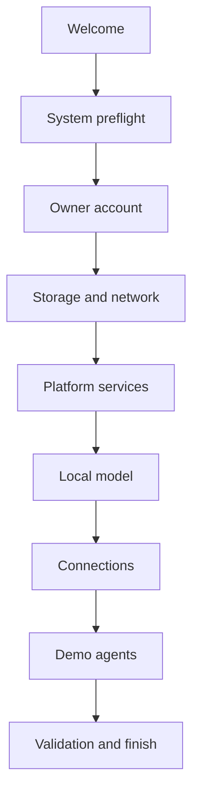

# Crewquarters

> **Your own local AI crew.**

Crewquarters is the working product name and implementation blueprint for a demo-first, locally deployed AI-agent marketplace targeting NVIDIA GB10 systems such as DGX Spark-class and OEM equivalents.

## What this project is

Crewquarters lets the owner of a GB10 appliance assemble their own local AI crew: install open-weight models, add agents from a curated catalog, run those agents in isolated containers, schedule them, answer agent questions in a web interface, and give them controlled access to local knowledge and approved external services.

The first version is deliberately a single-machine demonstrator. It is meant to work on a developer laptop without a GPU and to demonstrate real local inference on the GB10 machine. It is not yet a public, hostile-code marketplace or a permanently hosted SaaS product.

The demo ships with two agents:

1. **Caller agent** — reads consenting recipients from Google Sheets, asks the operator to confirm, places a fixed-script call through Twilio, captures a short speech response, and writes the outcome to a results sheet/tab.
2. **Daily Gmail digest agent** — reads the previous calendar day's Gmail messages, uses a local model to classify and summarize them, and shows urgent, important, and low-priority items in the web UI.

## Product goals

- One-command local installation with an `arm64` path for DGX OS and an `amd64`/`arm64` laptop development path.
- A web UI for models, agents, schedules, approvals/input, connections, knowledge bases, runs, logs, and opt-in chat.
- On-demand vLLM model loading. Downloaded weights stay on disk; inactive models do not remain resident in unified memory.
- More than one installed model, with concurrent residency only when an admission controller decides the combined memory budget is safe.
- A Python SDK that hides platform plumbing from agent authors.
- Durable schedules, run records, events, and user-input requests in one PostgreSQL database.
- Local retrieval-augmented generation using PostgreSQL plus `pgvector`.
- Google OAuth for Gmail and Sheets, plus API-key connections for Twilio, OpenAI, and Anthropic.
- Clear service boundaries so five developers can work in parallel.

## Non-goals for the first demo

- Running arbitrary, unreviewed internet marketplace images safely.
- Billing, commercial publishing, ratings, payments, organizations, or multi-tenant RBAC.
- General-purpose connector support beyond Google, Twilio, OpenAI, and Anthropic.
- Exactly-once execution of arbitrary agent side effects.
- OCR, image understanding, or every document format in the knowledge base.
- Automatic two-node model sharding. NVIDIA documents multi-node vLLM for DGX Spark, but it adds Ray, SSH, networking, failure, and model-specific tuning work and is deferred.
- Kubernetes in v1. It adds operational work without solving the hardest security boundary on a single owner-operated box.

## Design principles

1. **Local by default.** Prompts and knowledge stay on the device unless the user or agent explicitly chooses an enabled cloud profile.
2. **Brokers hold credentials.** Agent containers receive short-lived capability tokens, never Google refresh tokens, Twilio credentials, cloud API keys, or the Docker socket.
3. **Curated before open.** The demo catalog contains reviewed, digest-pinned images. Container isolation is useful but is not a sufficient hostile multi-tenant sandbox.
4. **One system of record.** PostgreSQL stores application state, the job queue, schedules, chat history, knowledge metadata/vectors, audit records, and agent records. Large files and model weights live on local disk with their paths and checksums in PostgreSQL.
5. **Contracts before implementation.** OpenAPI, event schemas, the agent manifest, and SDK behavior are versioned before services are developed independently.
6. **Demo reliability over platform cleverness.** Docker Compose and systemd are the default; Kubernetes remains an upgrade path.

## High-level architecture

```mermaid
flowchart TB
    U["Browser"] --> RP["Reverse proxy"]
    RP --> UI["Web UI"]
    RP --> API["Control API"]
    API --> DB[("PostgreSQL + pgvector")]
    API --> W["Scheduler / worker"]
    W --> RD["Runtime daemon"]
    RD --> A["Per-run agent containers"]
    A --> B["Capability broker"]
    B --> MG["Model gateway"]
    B --> KB["Knowledge service"]
    B --> G["Google / Twilio adapters"]
    MG --> V["On-demand vLLM container"]
    MG --> C["OpenAI / Anthropic"]
```



Only the reverse proxy is exposed to the browser. The runtime daemon is a host service reached over a Unix socket. vLLM development/lifecycle endpoints, Docker, PostgreSQL, the connector broker, and internal service APIs are never exposed to the LAN or internet.

## Services and ownership boundaries

| Component | Responsibility | Does not own |
| --- | --- | --- |
| Web UI | Operator workflows, streaming run events, chat, input/approval forms | Scheduling, secrets, containers, model decisions |
| Control API | Local login, catalog, installations, runs, schedules, policies, public API | Direct Docker access or model processes |
| Scheduler/worker | PostgreSQL-backed jobs, retries, leases, cron evaluation, run dispatch | UI, OAuth, inference implementation |
| Runtime daemon | Pull/start/stop/inspect agent and vLLM containers; enforce resource profiles | User auth, business records, raw provider credentials |
| Model gateway | Stable LLM API, model leases, local/cloud routing, budgets, streaming; decrypts OpenAI/Anthropic keys itself | Agent lifecycle or direct web access |
| Knowledge service | Parse, chunk, embed, index, retrieve, and cite local documents | General file storage UI or model installation |
| Capability/connector broker | Validate per-run permissions; Google and Twilio credentials and calls | Scheduling, cloud LLM keys, or arbitrary internet proxying |
| Python SDK | Typed developer interface for LLMs, knowledge, inputs, events, and connectors | Storing long-lived secrets or managing Docker |
| PostgreSQL | Single transactional system of record and vector store | Large model weights and uploaded file bytes |

The services live in one monorepo and may share Python libraries, but they run as separate processes/containers with explicit APIs. For demo deployment, the control API, scheduler, model gateway, knowledge service, and connector broker can initially be built from one Python image with different commands.

## Web UI experience

The UI is designed as a local appliance control plane rather than a developer dashboard. It must let an owner complete installation, connect services, install models and agents, approve actions, and diagnose ordinary failures without using a terminal.

The persistent navigation contains:

- **Overview** — device health, attention items, active work, recent results, and upcoming schedules.
- **Crew** — discover agents and manage the agents already in your crew.
- **Activity** — missions/runs and unanswered Crew Requests.
- **Models** — model catalog, downloads, disk installation, memory residency, and leases.
- **Knowledge** — knowledge bases, documents, indexing, and retrieval testing.
- **Chat** — explicitly enabled local RAG chat with citations.
- **Connections** — Google, Twilio, OpenAI, and Anthropic.
- **Schedules** — timezone-aware recurring runs.
- **System** — status, audit history, settings, diagnostics, and backups.

The interface consistently separates:

- `Installed on disk` from `Loaded in memory`;
- `Local on this device` from `Cloud · OpenAI/Anthropic`;
- an installed agent from an agent that is ready to run;
- a schedule definition from a live agent run.

### First-run flow

Installing the `arm64` `.deb` creates a desktop launcher and starts the bootstrap services. Opening **Crewquarters** launches a resumable setup wizard in the browser:



Long operations such as image pulls, model downloads, model cold starts, document indexing, and agent runs create durable jobs. The UI shows real stages/progress, survives refresh, and reconnects without starting the operation again.

### Important interaction flows

- **Install an agent:** Marketplace → agent detail → compatibility → permissions → configuration → optional schedule → review → installed-agent page.
- **Run an agent:** Run now → preparing → optional model cold start → running → possible user question → result.
- **Human approval:** pending questions appear on the dashboard, Activity page, and run detail; answering is versioned and remains visible in the timeline.
- **Knowledge chat:** create knowledge base → upload/index files → test retrieval → enable local chat → ask → inspect citations → disable chat/release lease.
- **Caller:** read consenting rows → display masked recipients and script → approve exact call count → place calls → show statuses/transcripts → write results.
- **Gmail digest:** select previous local calendar day → summarize → render Urgent, Important, and Low priority sections with Gmail links.

Visual direction is calm and appliance-like: light neutral surfaces, restrained indigo primary actions, teal `Local` labels, purple `Cloud` labels, clear semantic success/warning/danger states, 4 px spacing scale, accessible typography, and minimal motion. Every status combines words and icons with color. The full page anatomy, design tokens, component rules, responsive behavior, error states, and acceptance criteria are specified in [PLAN.md](./PLAN.md#13-web-ui-specification).

## Chosen technology

| Layer | Choice | Reason |
| --- | --- | --- |
| Web | React + TypeScript + Vite, TanStack Query, a small component system | Fast local build, static deploy, typed API client |
| Backend | Python 3.12, FastAPI, Pydantic, SQLAlchemy, Alembic | Matches the agent SDK and has strong async/API support |
| Database/queue | PostgreSQL 16+ with `pgvector`; a small `FOR UPDATE SKIP LOCKED` job queue | One database and no Redis dependency |
| Local inference | NVIDIA-tested vLLM container with OpenAI-compatible serving | Required by the product and supported by NVIDIA's DGX Spark playbook |
| Agent isolation | Docker containers, one ephemeral container per run | Available on DGX OS; simple on one appliance |
| Host integration | `systemd` runtime daemon; `arm64` `.deb` plus a development installer | Narrow, auditable ownership of Docker and device operations |
| Knowledge embeddings | Small local sentence-transformer on CPU initially | Avoids keeping a second large GPU model resident |
| Google | OAuth 2.0 web-server flow, Gmail API, Sheets API | Supports scheduled access through refresh tokens |
| Voice | Twilio Programmable Voice, signed webhooks, `<Say>` + speech `<Gather>` | Smallest realistic outbound-call demo |
| Cloud LLM | Direct adapters for OpenAI Responses and Anthropic Messages | Only the two requested cloud providers |
| Packaging | Docker Compose profiles and multi-architecture application images | Same control plane on laptops and `arm64` GB10 devices |

## Model lifecycle

Models have two distinct states: **installed on disk** and **resident in memory**. Installing a model downloads a pinned revision and records its license, size, checksum, quantization, launch arguments, and expected memory envelope. It does not start vLLM.

When a run or chat session asks for a model, the gateway requests a lease. The model manager:

1. Coalesces concurrent requests for the same model.
2. Checks current free unified memory, model size, KV-cache budget, and a reserved system headroom.
3. Starts the pinned vLLM container and waits for health/readiness.
4. Routes requests only after the served model name matches the requested profile.
5. Releases the lease after the run/chat ends.
6. Stops the container after an idle timeout when no leases remain.

The safe v1 policy is one primary generative model at a time. Multiple small models may run only after a measured admission check. A conservative default leaves 24 GiB for the OS, database, agents, and transient allocations, caps model-serving allocation near 96 GiB, and uses a modest context length. Exact limits must be benchmarked on the target OEM GB10 image.

vLLM now documents a sleep mode, but its online control endpoints require development mode and must not be exposed. Because the GB10 uses coherent unified memory, v1 uses process/container stop for deterministic release; sleep/wake may be evaluated behind the internal network as an optimization.

## Agent lifecycle and isolation

An installed agent is a versioned manifest plus a digest-pinned OCI image. A run gets:

- a new non-root container;
- a read-only root filesystem and temporary `/tmp`;
- CPU, memory, and PID limits, plus two time limits: an active-time limit that pauses while the agent waits for an answer, and a separate input-wait limit;
- all Linux capabilities dropped and `no-new-privileges` enabled;
- no Docker socket and no host mounts except an optional per-run scratch directory;
- no general outbound network access for the demo use cases;
- a short-lived, run-scoped token that authorizes only declared SDK capabilities.

Google, Twilio, knowledge, local LLM, and cloud LLM calls go through the platform broker. The install screen shows every requested capability and requires owner approval.

This is a strong boundary for a curated single-owner demo, not a promise that Docker alone can safely execute malicious marketplace code. A public marketplace needs image signing, SBOMs, vulnerability scanning, review, egress enforcement, and a stronger sandbox such as gVisor, Kata Containers, or microVMs.

## Agent manifest

```yaml
apiVersion: crewquarters/v1alpha1
kind: Agent
metadata:
  id: daily-gmail-digest
  name: Daily Gmail Digest
  version: 0.1.0
spec:
  image: ghcr.io/example/daily-gmail-digest@sha256:REQUIRED_DIGEST
  entrypoint: ["python", "-m", "agent"]
  architectures: ["linux/amd64", "linux/arm64"]
  triggers: ["manual", "schedule"]
  permissions:
    llmProfiles: ["local.general"]
    knowledge: []
    connectors:
      google: ["gmail.readonly"]
    cloudProviders: []
    userInput: true
  resources:
    cpu: 2
    memoryMb: 2048
    activeTimeoutSeconds: 1800
    maxInputWaitSeconds: 86400
  configurationSchema:
    type: object
    required: [timezone]
    properties:
      timezone:
        type: string
      maxMessages:
        type: integer
        default: 200
```

The control API validates manifests against a checked-in JSON Schema. Installed records preserve the complete manifest, image digest, approval set, and SDK protocol version.

## Python SDK shape

The SDK is intentionally small. A developer writes ordinary Python and calls platform capabilities through the injected run context.

```python
from crewquarters import Agent, RunContext

agent = Agent(id="example-agent")

@agent.run
async def run(ctx: RunContext) -> dict:
    answer = await ctx.input.ask(
        key="confirm",
        title="Continue?",
        prompt="The agent is ready to act. Should it continue?",
        choices=["Continue", "Cancel"],
        timeout_seconds=86_400,
    )
    if answer.value != "Continue":
        return {"status": "cancelled"}

    passages = await ctx.knowledge.search(
        knowledge_base_id=ctx.config["knowledgeBaseId"],
        query="relevant context",
        top_k=5,
    )
    result = await ctx.llm.chat(
        profile="local.general",
        messages=[{"role": "user", "content": passages.as_context()}],
    )
    await ctx.events.progress(percent=100, message="Complete")
    return {"answer": result.text}

agent.serve()
```

Initial SDK modules:

- `ctx.llm.chat(...)` — local, OpenAI, or Anthropic through named profiles; cloud use is explicit.
- `ctx.knowledge.search(...)` — scoped retrieval with source metadata.
- `ctx.input.ask(...)` — creates a web input request and waits by heartbeat/polling.
- `ctx.events.*` — structured logs, progress, artifacts, and status.
- `ctx.google.gmail.*` and `ctx.google.sheets.*` — narrow proxied operations.
- `ctx.telephony.call(...)` — fixed-script Twilio call request for the demo.
- `ctx.idempotency.once(...)` — platform idempotency key helper for external actions.

For v1, a waiting agent container remains alive with a low CPU limit while `ctx.input.ask` waits. The active-time clock (`activeTimeoutSeconds`) pauses during the wait; the wait itself is bounded by `maxInputWaitSeconds` (default 24 hours). Its request and answer are durable, but a platform restart marks the attempt interrupted and lets the operator retry. Durable suspend/resume of arbitrary Python is deferred to a workflow-engine phase.

## Scheduling semantics

- A schedule stores a cron expression, an IANA timezone, enabled state, `next_run_at` in UTC, and a misfire policy.
- Default misfire policy is `fire_once`: if the appliance was off at 10:00, enqueue one run when it returns rather than replaying every missed occurrence.
- A unique `(schedule_id, scheduled_for)` constraint prevents duplicate scheduled run records.
- Jobs use leases and retries, so execution is at-least-once. Agents must provide idempotency keys for calls, writes, or other external side effects.
- The target for an online appliance is dispatch within five seconds of the scheduled time, verified by an automated test.

## Knowledge base and local chat

The first knowledge pipeline supports UTF-8 text, Markdown, PDF with embedded text, DOCX, and CSV. It stores original files under a platform-owned data directory and stores extracted text, chunks, vectors, checksums, and access metadata in PostgreSQL.

Pipeline: validate upload → virus/size/type checks → extract text → normalize → chunk → embed locally → insert `pgvector` rows → mark ready. Scanned PDFs and OCR are explicitly unsupported in v1.

Chat is disabled by default. Enabling it creates a model lease for the selected local model; disabling it releases the lease. A chat request retrieves authorized passages, builds a context with source labels, calls the local model, streams the response, and records citations. After ten idle minutes and no other leases, the model unloads.

## Authentication and secrets

Local platform login uses a first-run owner account, Argon2id password hashing, HTTP-only secure session cookies, CSRF protection, and rate limiting. It binds to localhost by default. LAN exposure is an explicit option that always uses HTTPS; a headless install turns it on automatically with a device-generated certificate and a one-time setup code.

Google uses the OAuth 2.0 web-server flow with offline access, exact redirect URI validation, `state`, and PKCE where supported. The demo requests only:

- `gmail.readonly` for the digest agent;
- `spreadsheets` for reading the caller list and writing results.

Google classifies `gmail.readonly` as restricted and the broad Sheets scope as sensitive. A test-mode OAuth app is acceptable for a controlled demo, but its test-user authorization and refresh token expire after seven days. A real product must complete the applicable verification/security work or use an internal Workspace app.

OAuth refresh tokens and provider API keys are encrypted in PostgreSQL using a master key stored in a root-readable file outside the database and source tree. Only two services can read that key: the capability broker decrypts Google and Twilio secrets, and the model gateway decrypts OpenAI and Anthropic keys, so decrypted credentials never pass between services. Agents receive neither refresh tokens nor provider keys.

## Demo agents

### Caller agent

Input sheet columns: `name`, `phone_e164`, `consent`, `status`. The agent rejects rows without an affirmative consent value, asks the operator to confirm the final count and script, limits the demo batch to three verified destinations, and uses an idempotency key per row. Twilio calls the recipient, reads the fixed script, gathers a short speech response, and sends signed callbacks to the platform. The result tab records call SID, final status, transcript, timestamps, error, and source row.

Twilio trial accounts can call only verified recipients and have other trial limits. The demo must use test-team numbers, provide a clear automated-call/recording disclosure, and never be used for unsolicited calling. Applicable calling, recording, privacy, and do-not-call rules require separate legal review before any real use.

### Daily Gmail digest agent

The agent computes yesterday's boundaries in the configured timezone, converts them to epoch timestamps for a Gmail query, paginates to a configured limit, and fetches message content. It treats all email text as untrusted data, strips quoted/unsafe markup, and never follows instructions found inside messages. It performs bounded map/reduce summarization and produces three groups: urgent, important, and low priority, each with reasons, next actions, and links/message identifiers. The digest is stored in the run result and rendered in the UI.

## Deployment profiles

| Profile | Intended environment | Local inference |
| --- | --- | --- |
| `dev` | Any `amd64` or Apple/Linux `arm64` laptop | Mock gateway or OpenAI/Anthropic; optional compatible local server |
| `demo-cpu` | Laptop end-to-end UI, jobs, OAuth, knowledge, agents | Small CPU model optional; otherwise mock/cloud |
| `dgx` | GB10 appliance with DGX OS, Docker, NVIDIA Container Toolkit | NVIDIA-tested vLLM container with GPU access |
| `demo-public-callbacks` | Temporary controlled demo needing OAuth/Twilio callbacks | Adds a fixed HTTPS tunnel endpoint; never exposes internal services |

The GB10 host path installs only the runtime daemon and configuration on the host. Application services, PostgreSQL, agents, and vLLM run in containers. Images used on the appliance must have `linux/arm64` variants; an `amd64`-only image cannot be fixed by `.deb` compatibility.

## Installable HP/GB10 appliance package

The recommended delivery has two forms:

- `crewquarters_<version>_arm64.deb` — the normal online installer;
- `crewquarters-offline_<version>_arm64.tar.zst` — the demonstration bundle containing the `.deb`, pinned OCI image archives, checksums, SBOMs, and optionally one validated model bundle.

The `.deb` installs the runtime daemon, administration CLI, systemd service/socket, Compose definitions, desktop launcher, default configuration, and upgrade/uninstall scripts. Its package hook remains short and non-interactive. The first-run web wizard performs image/model downloads, owner setup, credential entry, agent selection, and validation with visible progress.

Only the restricted runtime daemon runs directly on DGX OS. The web UI, API, scheduler, brokers, knowledge service, model gateway, and PostgreSQL run through Compose; agents and vLLM run in separately managed containers. Removing the package preserves `/var/lib/crewquarters` unless the operator explicitly chooses a purge operation.

## Why Docker Compose, not Kubernetes, for v1

K3s supports `arm64/aarch64`, so Kubernetes is possible. It is not the best first milestone: this is a single owner-operated machine, Docker and the NVIDIA runtime are already configured on DGX Spark, and agent isolation still depends on runtime policy rather than the scheduler brand. Compose produces a smaller installer, faster debugging, and an easier laptop demo.

Revisit k3s when one of these becomes true: multiple appliances are scheduled as a pool; high availability is required; there are many long-running services; GPU scheduling must span nodes; or the team adopts a stronger Kubernetes sandbox/runtime. Multi-node vLLM remains a separate model-serving project, not an automatic result of installing Kubernetes.

## Target repository layout

```text
apps/
  web/
services/
  control_api/
  scheduler/
  runtime_daemon/
  model_gateway/
  knowledge/
  capability_broker/
packages/
  contracts/
  python_sdk/
  shared_python/
agents/
  caller/
  gmail_digest/
infra/
  compose/
  systemd/
  debian/
  scripts/
tests/
  contract/
  integration/
  e2e/
docs/
```

## Demo definition of done

A new GB10 device passes the demo when an operator can:

1. Run the installer and open the UI.
2. Create the owner account and connect a Google test account.
3. Install a pinned, NVIDIA-tested local model and see disk/load/readiness states.
4. Upload documents, build a knowledge base, enable chat, receive a cited answer, disable chat, and observe model unload after the idle deadline.
5. Install both bundled agents from the catalog.
6. Schedule the Gmail digest, run it manually, and receive a correctly grouped previous-day digest.
7. Configure the caller sheet, approve the agent's web prompt, call verified test numbers, and see results written back.
8. Run two agents that share one model without starting duplicate vLLM processes.
9. Select an explicitly enabled OpenAI or Anthropic profile for one test request and see the cloud-use audit event.
10. Reboot the device and retain users, connections, models-on-disk, schedules, documents, and run history while leaving unused models unloaded.

The full implementation specification, five-person work split, prompts, API/data contracts, risks, test matrix, and delivery gates are in [PLAN.md](./PLAN.md).

## Primary references

Reviewed on 2026-09-24:

- [NVIDIA DGX Spark hardware overview](https://docs.nvidia.com/dgx/dgx-spark/hardware.html)
- [NVIDIA: Serve LLMs with vLLM on DGX Spark](https://build.nvidia.com/spark/vllm)
- [NVIDIA container runtime for Docker on DGX Spark](https://docs.nvidia.com/dgx/dgx-spark/nvidia-container-runtime-for-docker.html)
- [vLLM OpenAI-compatible server](https://docs.vllm.ai/en/latest/serving/online_serving/openai_compatible_server/)
- [vLLM sleep mode and its development-endpoint warning](https://docs.vllm.ai/en/stable/features/sleep_mode/)
- [Google OAuth 2.0 web-server flow](https://developers.google.com/identity/protocols/oauth2/web-server)
- [Google Gmail scopes](https://developers.google.com/workspace/gmail/api/auth/scopes)
- [Google Sheets scopes](https://developers.google.com/workspace/sheets/api/scopes)
- [Twilio outbound Call resource](https://www.twilio.com/docs/voice/api/call-resource)
- [Twilio trial restrictions](https://www.twilio.com/docs/usage/tutorials/how-to-use-your-free-trial-account)
- [OpenAI API overview](https://developers.openai.com/api/reference/overview)
- [Anthropic Messages API](https://platform.claude.com/docs/en/api/messages)
- [K3s architecture requirements](https://docs.k3s.io/installation/requirements)
