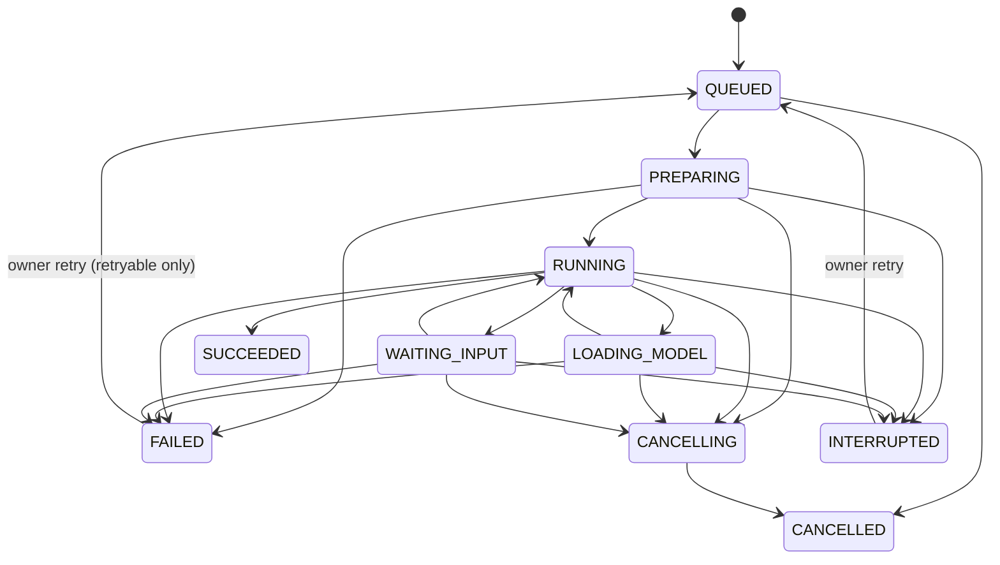

# 0006. Run lifecycle, attempts, and time limits

- Status: Accepted
- Date: 2026-09-24
- Owner: Nikhil Hiro Ghind (Person 1)

## Context

Runs must survive worker crashes and platform restarts, wait up to 24 hours for human input, and never repeat external side effects silently. PLAN.md section 7.2 defines the state machine, and fix 1 in the plan separates active time from waiting time.

## Decision

**State machine** (`crewquarters_shared/runs/states.py`, enforced by `runs/service.py:transition`):

`SUCCEEDED` and `CANCELLED` are final. Every transition appends a `run.state_changed` event, and the per-run event sequence is serialized by the run row lock.

**Attempts**

- Each start creates a `run_attempts` row, unique per `(run_id, attempt)`.
- Retry increments `current_attempt` and enqueues `run.dispatch` with dedupe key `run:{id}:attempt:{n}`.
- Calls from the broker and SDK name their attempt. Any call from an older attempt fails with `409 STALE_ATTEMPT`.

**Starting containers**

- The worker holds the run row lock while it calls `RuntimeAdapter.start_run`.
- `start_run` must be idempotent on `(run_id, attempt)`. If `runtime_ref` is already set, a reclaimed dispatch job does nothing more.
- A run that still has an active attempt gets exactly one container, even after a worker crash.
- The worker never holds the run row lock during runtime calls. It commits `PREPARING` and the attempt, starts the container unlocked, then re-locks to record the runtime reference. If the run was cancelled or failed in between, it stops the new container.
- Dispatch refuses a disabled, removed, or unapproved installation (`INSTALLATION_NOT_READY`), and an owner retry re-checks readiness.

**Time limits** (manifest `resources`)

- `activeTimeoutSeconds` counts time in `PREPARING`, `LOADING_MODEL`, and `RUNNING`.
- `maxInputWaitSeconds` (at most 86 400) counts time in `WAITING_INPUT`.
- Elapsed time is added to `active_seconds_used` or `input_wait_seconds_used` on every transition.
- The reconciler (`crewquarters_scheduler/reconciler.py`) fails runs with `ACTIVE_TIMEOUT` or `INPUT_TIMEOUT` (not retryable) and enqueues `run.stop`. It checks the wait budget before expiring inputs.
- A single `ctx.input.ask` timeout may not exceed the remaining wait budget (`422 INPUT_WAIT_BUDGET_EXCEEDED`).
- Both limits are per attempt: an owner retry resets both counters.
- The capability token lives for the prepare timeout + both limits + 300 s, so it cannot expire during a legitimate attempt. The broker still rejects it once the run is inactive or the attempt is not current.

**Heartbeats**

- The SDK heartbeats through the broker. Each heartbeat extends `run_attempts.heartbeat_expires_at` by `CQ_HEARTBEAT_TIMEOUT_SECONDS`. Before the handshake, the lease is `CQ_PREPARE_TIMEOUT_SECONDS`.
- An expired lease moves the run to `INTERRUPTED` with `HEARTBEAT_LOST` (retryable), and the container is stopped. This covers container crashes, hung agents, and platform restarts.

**Input requests**

- Requests are unique per `(run_id, key)`. A retried attempt that asks the same key gets the existing request: an answer given to an earlier attempt is returned as-is, and a request that an earlier attempt left `cancelled` or `expired` (for example after a restart) is reopened as `pending` with a new version and deadline.
- Agent-supplied input schemas may not use `pattern` or `patternProperties` (catastrophic-backtracking protection) and are limited to 16 KiB. Previews and answers are limited to 64 KiB, and agent events to 16 KiB.
- The model gateway's loading signal only moves `RUNNING` ↔ `LOADING_MODEL`; in any other state it is a no-op, so it cannot pull a run out of `WAITING_INPUT`.
- Answers carry the request `version`. A stale version returns `409 VERSION_CONFLICT` and a closed request returns `409 INPUT_ALREADY_CLOSED`.
- Answers are validated against the request's JSON Schema.
- Expired, cancelled, or answered requests move a `WAITING_INPUT` run back to `RUNNING` once none are left pending.

**Idempotency actions** (`ctx.idempotency`, table `idempotency_actions`, unique per `(run_id, key)`). A claim returns one of three statuses:

- `claimed`: proceed with the action. Only the call that creates the key ever receives this;
- `completed`: returns the stored result;
- `in_doubt`: the key was claimed earlier (by this attempt, for example a retried request whose response was lost, or by an earlier attempt) and never completed, so the action may already have happened. The agent must check the provider's state before acting. The key stays `in_doubt` until completed.

**Lock order.** Code always locks the `agent_runs` row before any `input_requests` row, which prevents deadlocks between answers, cancels, and the reconciler.

## Consequences

- Delivery is at least once, and every side effect is guarded by a key.
- An `INTERRUPTED` run is recovered by an explicit owner retry, not automatically. The UI shows whether external actions already happened.
- Durable suspend/resume of arbitrary Python is still deferred (PLAN.md section 26).
